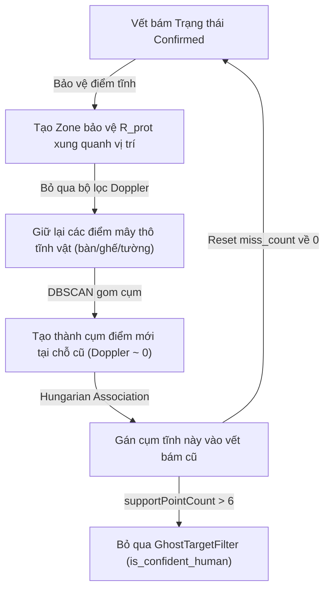

# BÁO CÁO PHÂN TÍCH NGUYÊN NHÂN GỐC RỄ (ROOT CAUSE ANALYSIS - RCA)
## HÀNH TRÌNH TỐI ƯU HÓA HỆ THỐNG 3D PEOPLE TRACKING (mmWAVE RADAR IWR6843AOP)

Tài liệu này tổng hợp toàn bộ các vấn đề kỹ thuật phát sinh, nguyên nhân gốc rễ (vật lý sóng điện từ, hình học và logic phần mềm) và các giải pháp tương ứng đã được triển khai qua các phiên bản phát triển từ **Version 1.0** đến **Version 27.0**.

---

## I. TỔNG QUAN HÀNH TRÌNH PHÁT TRIỂN & CẢI TIẾN

Dưới đây là bảng tóm tắt tiến trình giải quyết lỗi và tối ưu hóa hệ thống qua từng phiên bản:

| Phiên bản | Vấn đề phát hiện | Nguyên nhân gốc rễ | Giải pháp đã triển khai |
| :--- | :--- | :--- | :--- |
| **v1.0 - v2.0** | Nhiễu sàn lớn, sinh hộp ảo (Ghost Box) tĩnh; Hộp kép (Double Box) cho cùng một người. | - Nhiễu phản xạ đa đường (Multipath) từ mặt sàn.<br>- Trục Z bị âm hoặc lệch sâu do chưa lọc giới hạn ROI dọc. | - Thiết lập vùng lọc ROI trục dọc Z từ 0.20m đến 2.50m.<br>- Nâng ngưỡng lọc nhiễu CFAR tĩnh/động của radar vật lý. |
| **v3.0 - v5.0** | Hộp bám vết bị giật lắc (Jittering); Nhảy mã định danh ID ngẫu nhiên; Mất dấu mục tiêu ảo. | - DBSCAN phân cụm trả về thứ tự ngẫu nhiên trong bộ nhớ.<br>- Sử dụng Nearest Neighbor tham lam cho liên kết ID liên frame. | - Tách biệt khoảng cách gộp cụm nội frame (0.85m) và bán kính tracker liên frame (1.30m).<br>- Tăng thời gian lưu bộ đệm giữ khung khi mất điểm thô. |
| **v6.0 - v10.0** | Lệch phối cảnh 3D; Mất điểm mây người đứng im; ID bị tráo đổi khi đi gần nhau. | - Tốc độ Doppler người đứng im bằng 0 bị bộ lọc tĩnh vật triệt tiêu.<br>- Lắp đặt radar nghiêng nhưng tính toán hệ tọa độ thẳng. | - Triển khai phép xoay tọa độ phòng (Room Coordinates) theo góc nghiêng $\theta$ và chiều cao.<br>- Triển khai thuật toán Kuhn-Munkres (Hungarian fallback). |
| **v11.0 - v15.0** | Mất đồng bộ phối cảnh camera-radar; Hộp bám đuổi lết chậm khi tăng tốc nhanh; Lỗi sót webcam. | - Sai lệch chiều cao Sensor vẽ mô phỏng ($Z=0$ vs thực tế $1.15$m).<br>- Hệ số làm mịn Kalman $\alpha$ cố định không đáp ứng động lực học. | - Tích hợp Webcam đồng bộ ghi hình side-by-side.<br>- Triển khai hệ số $\alpha$ thích nghi theo vận tốc thực tế.<br>- Quét tự động tìm cổng USB Webcam Logitech cắm mới. |
| **v16.0 - v20.0** | Ma trận quay bị đảo ngược ở khoảng cách xa; Hộp ma kẹt tại bàn ghế tĩnh; Mất dấu khi đứng yên >5s. | - Sai dấu góc Pitch trong toán học xoay (chĩa lên trần thay vì xuống sàn).<br>- Bộ lọc tĩnh vật bỏ sót mục tiêu phần cứng. | - Đảo dấu ma trận quay Pitch DOWN ($-\theta$).<br>- Chuyển bộ lọc tĩnh vật $\sigma_{xy}$ lên tầng dùng chung `GhostTargetFilter`.<br>- Tích hợp bộ lọc IMM 3D (Stop & Constant Velocity model). |
| **v21.0 - v24.0** | **Lỗi Khóa Cứng Bóng Ma Tĩnh (Lock-on Trap)**: Người đi khỏi phòng nhưng hộp bám vết kẹt lại ở ghế/tường. | - Vòng lặp phản hồi ngược: Bán kính bảo vệ zone giữ lại điểm tĩnh $\rightarrow$ DBSCAN gộp $\rightarrow$ Tracker gán ID $\rightarrow$ Reset đếm.<br>- Lỗ hổng logic bảo vệ tĩnh dựa vào số điểm `supportPoints > 6`. | - Cơ chế **Dynamic State Locking** khóa trạng thái người thật dựa trên lịch sử vận tốc $\ge 0.15$m/s.<br>- Thu hẹp bán kính bảo vệ điểm tĩnh về $0.45$m khi đứng im, đóng hoàn toàn $0.0$m với vật thể tĩnh. |
| **v25.0 - v27.0** | Sai số cự ly 0.4m và chiều cao 0.69m; Nghẽn cổ chai luồng; Triển khai hệ thống nhúng headless. | - Phép xoay tọa độ kép (Double Transformation): Cả phần cứng chip GTRACK và Python cùng xoay góc nghiêng.<br>- GIL Python nghẽn do UART + Matplotlib chung luồng. | - Tắt xoay tọa độ trong Python cho mục tiêu phần cứng.<br>- Thiết kế giao diện 2D HUD tròn và 4 Widget chẩn đoán.<br>- Xây dựng chạy ngầm Daemon Serial API cho thiết bị IQ9 Linux. |

---

## II. PHÂN TÍCH CHUYÊN SÂU NGUYÊN NHÂN GỐC RỄ (RCA) CÁC VẤN ĐỀ CỐT LÕI

### 1. Vấn đề 1: Lỗi "Khóa Cứng Bóng Ma Tĩnh" (Room Lock-on Trap Feedback Loop)
> **Triệu chứng**: Khi người dùng đứng yên tại vị trí gần bàn/ghế rồi bước ra khỏi phòng quét, hộp bám vết (Human Box) của cả phần cứng (ID 1) và phần mềm (ID 1000+) vẫn bị kẹt cứng vô hạn tại chỗ cũ, không tự biến mất.

#### Sơ đồ Vòng lặp Phản hồi ngược (Feedback Loop):


#### Nguyên nhân gốc rễ:
1. **Vòng lặp tự bảo vệ**: Bộ lọc điểm tĩnh ở cấp độ điểm (Point-level Clutter Filter) được thiết lập để giữ lại các điểm có Doppler $\approx 0$ nằm trong vùng bán kính bảo vệ `STATIC_CLUTTER_POINT_PROTECTION_RADIUS = 1.2m` xung quanh các confirmed target nhằm tránh xóa nhầm người đứng im. Tuy nhiên, khi người dùng rời đi, zone bảo vệ này vẫn tồn tại tạm thời. Các phản xạ tĩnh của ghế kim loại/tường nằm trong zone này được bảo vệ, DBSCAN gom cụm lại và Hungarian gán ngược vào ID cũ, làm reset bộ đếm mất dấu (`miss_count`), khóa cứng vết bám.
2. **Lỗ hổng kiểm duyệt dáng người**: Trong bộ lọc [filters.py](file:///home/ubuntu/sensor/People%20Tracking/src/filters.py), điều kiện bảo vệ người thật `is_confident_human` chứa logic: `(supportPointCount > 6)`. Các cụm phản xạ tĩnh của ghế hoặc góc tường kim loại dễ dàng có số điểm phản xạ $> 6$, khiến chúng luôn được bỏ qua bộ lọc tĩnh vật toàn diện và hiển thị hộp ma mãi mãi.

#### Giải pháp khắc phục triệt để (Version 24.0):
* **Cổng bảo vệ không gian thích nghi (Adaptive Spatial Protection Gate)**:
  * Khi mục tiêu di chuyển ($v \ge 0.15\text{ m/s}$): Mở rộng bán kính bảo vệ `r_prot = 0.85m` để bao quát cơ thể.
  * Khi mục tiêu đứng im ($v < 0.15\text{ m/s}$) và đã được xác nhận là người thật: Thu hẹp bán kính bảo vệ xuống `r_prot = 0.45m` (vừa khít cơ thể người, loại bỏ bàn ghế nằm xa ngoài bán kính).
  * Khi mục tiêu đứng im và chưa từng di chuyển (vật thể tĩnh): Đóng hoàn toàn cổng bảo vệ `r_prot = 0.0m`, triệt tiêu hoàn toàn mây điểm của vật thể tĩnh này để bộ lọc Doppler xóa sạch.
* **Khóa trạng thái động học (Dynamic State Locking)**: Tích hợp lịch sử vận tốc `track_motion_history`. Chỉ giữ trạng thái bảo vệ con người nếu mục tiêu đó đã từng di chuyển với vận tốc tích lũy $v \ge 0.15\text{ m/s}$ hoặc có điểm dáng người thực sự tự tin (`humanScore > 40`). Loại bỏ hoàn toàn điều kiện lỗi thời `supportPointCount > 6`.

---

### 2. Vấn đề 2: Lỗi Sai lệch Tọa độ và Góc nhìn 3D (Double Transformation & Pitch Inversion)
> **Triệu chứng**: Khi người di chuyển ra xa radar, hộp bám đuổi trên đồ thị 3D Matplotlib bị đẩy vút lên trời hoặc lệch góc perspective rất lớn so với hình ảnh thực tế từ camera Logitech. Giao diện báo lệch cự ly khoảng $+0.4\text{m}$ chiều sâu và $+0.69\text{m}$ chiều cao.

#### Nguyên nhân gốc rễ:
1. **Sai dấu góc xoay Pitch (Pitch Inversion)**: Radar lắp chĩa xuống sàn một góc $\theta = 30^\circ$ (Pitch DOWN, tương đương $-\theta$). Tuy nhiên trong mã nguồn chuyển đổi tọa độ ban đầu của [pointcloud_processing.py](file:///home/ubuntu/sensor/People%20Tracking/src/pointcloud_processing.py), ma trận xoay quanh trục X được viết với dấu của góc Pitch UP ($+\theta$):
   $$\text{posY}_{room} = y \cos(\theta) - z \sin(\theta)$$
   $$\text{posZ}_{room} = y \sin(\theta) + z \cos(\theta) + h$$
   Toán học sai dấu này khiến tọa độ người dùng bị xoay ngược lên trên khi đi xa.
2. **Phép xoay tọa độ kép (Double Transformation)**: Trong file cấu hình radar [3d_people_tracking.cfg](file:///home/ubuntu/sensor/People%20Tracking/example_configs/3d_people_tracking.cfg), lệnh `sensorPosition 0.8 0 0` đã báo cho thuật toán bám vết trên chip (GTRACK) rằng radar ở độ cao $0.8$m và chĩa thẳng. Chip radar tự động cộng bù $+0.8$m vào tọa độ $Z$. Khi Python nhận được mục tiêu thô (`raw_targets`), nó lại thực hiện xoay và tịnh tiến chiều cao $1.15$m một lần nữa trong hàm `transform_target_to_room_coordinates`. Sai số này nhân lên làm biến dạng toàn bộ hình học không gian.

#### Giải pháp khắc phục triệt để (Version 16.0 & Version 26.0):
* Sửa lại ma trận xoay trong Python về đúng dạng Pitch DOWN:
  $$\text{posY}_{room} = y \cos(\theta) + z \sin(\theta)$$
  $$\text{posZ}_{room} = -y \sin(\theta) + z \cos(\theta) + h$$
* Đồng bộ lệnh nạp cấu hình động gửi lên radar chip thông qua `config_sender.py` với các góc nghiêng vật lý thực tế.
* Loại bỏ hoàn toàn bước xoay tọa độ lặp trong Python đối với dữ liệu mục tiêu phần cứng (`raw_targets`), vì phần cứng radar đã thực hiện xoay tọa độ và bù chiều cao đồng bộ chuẩn xác.

---

### 3. Vấn đề 3: Người đứng im bị mất dấu (Static Target Drop / Doppler Blanking)
> **Triệu chứng**: Khi người đang di chuyển mượt mà đột ngột đứng yên đọc sách hoặc đứng đợi quá 5 giây, mây điểm thô giảm dần về 0 và hộp bounding box biến mất hoàn toàn mặc dù người vẫn ở đó.

```
                  [Người đang đứng im]
                           │
                           ▼ Doppler dịch chuyển về 0
            [Bộ lọc tĩnh vật CFAR & Doppler]
                           │
                           ▼ Lọc sạch các điểm có Doppler < 0.05m/s
               [Mây điểm người bị Fading]
                           │
                           ▼ Số điểm hỗ trợ = 0
             [Hộp bám vết biến mất (Mù vật lý)]
```

#### Nguyên nhân gốc rễ:
mmWave Radar hoạt động trên hiệu ứng Doppler. Khi người đứng im hoàn toàn, tần số Doppler dịch chuyển về $0$. Bộ lọc điểm tĩnh mặc định lọc sạch mọi điểm có Doppler $< 0.05\text{ m/s}$ nhằm chống nhiễu tường/bàn ghế. Điều này vô tình triệt tiêu toàn bộ các điểm phản xạ vi vĩ mô từ hơi thở và nhịp tim của con người, khiến mây điểm biến mất và tracker mất dấu.

#### Giải pháp khắc phục triệt để (Version 18.0 & Version 20.0):
* **Tầng Điểm (Point-level)**: Hạ ngưỡng lọc Doppler tĩnh vật xuống `STATIC_CLUTTER_POINT_DOPPLER_THRESHOLD = 0.015m/s` kết hợp zone bảo vệ chặt chẽ để nhặt lại các phản xạ vi động hô hấp ($0.02 - 0.08\text{ m/s}$) của cơ thể người.
* **Tầng Bộ lọc (Filter-level)**: Nâng cấp lên bộ lọc **IMM (Interacting Multiple Model) 3D** chạy song song hai mô hình động học:
  1. **Constant Velocity (CV)**: Dành cho chuyển động nhanh tích cực.
  2. **Stationary Model (STOP)**: Khóa chặt vận tốc thông qua việc giảm ma trận chuyển trạng thái $F$ và hạ hệ số nhiễu hệ thống $Q$ xuống cực tiểu ($0.01$) khi phát hiện vận tốc $<0.06\text{ m/s}$.
* **Tầng Vết bám (Track-level)**: Thiết lập cơ chế bỏ qua bộ lọc tĩnh vật toàn diện tại `GhostTargetFilter` nếu phát hiện có vi động thở (`0.015 <= doppler_std <= 0.10`) hoặc ID đó được trạng thái Dynamic State Locking bảo vệ.

---

### 4. Vấn đề 4: Nhảy ID và Nhiễu loạn Bounding Box khi bám vết đa mục tiêu
> **Triệu chứng**: Hộp bám đuổi bị giật cục nhẹ, nhấp nháy chớp tắt. Khi hai người đi giao nhau hoặc đứng gần, hệ thống bị tráo ID (Identity Switch) hoặc một người hút cả 2 hộp.

#### Nguyên nhân gốc rễ:
1. **Lỗi DBSCAN ngẫu nhiên**: DBSCAN nguyên bản trả về ID cụm dựa trên thứ tự điểm xuất hiện trong luồng UART, thứ tự này thay đổi ngẫu nhiên giữa các frame làm ID nhảy loạn (Jumping Box).
2. **Sự suy giảm mây điểm ở rìa (Peripheral Cloud Decay)**: Anten patch của IWR6843AOP có giản đồ hướng quét giới hạn ($\pm 60^\circ$ Azimuth). Ở rìa biên ($&gt;45^\circ$), độ lợi anten sụt giảm từ 3dB đến 6dB làm mây điểm bị thưa thớt, không đủ điểm hỗ trợ DBSCAN khiến hộp biến mất hoặc giật.
3. **So khớp Greedy (Nearest Neighbor) tham lam**: Chỉ gán cụm điểm cho track gần nhất mà không tối ưu tổng thể khoảng cách, dễ bị đánh lừa khi các mục tiêu giao cắt.

#### Giải pháp khắc phục triệt để:
* **Thuật toán Hungarian Data Association**: Xây dựng ma trận chi phí tối ưu hóa toàn cục kết hợp khoảng cách Euclidean 3D, độ lệch vận tốc Doppler và khoảng cách hiệp phương sai Mahalanobis. Hỗ trợ cơ chế tự động Fallback Kuhn-Munkres viết bằng NumPy nguyên bản nếu hệ thống nhúng không có `scipy`.
* **Nhân bù độ lợi biên (Antenna Edge Gain Compensation)**: Tự động nhân hệ số bù cường độ phản hồi dựa trên góc quét biên Azimuth $\theta$ để bù đắp sự suy hao tự nhiên của anten, giữ ổn định mây điểm ở rìa.
* **Tách biệt hai bán kính**: Giữ bán kính gộp cụm nội frame `VIRTUAL_CLUSTER_MERGE_DISTANCE_XY` từ $0.85$m đến $1.15$m để tránh tách box tay chân; sử dụng bán kính tracker liên frame `VIRTUAL_TRACKER_ASSOCIATION_RADIUS = 1.30m` để liên kết ID chắc chắn.

---

### 5. Vấn đề 5: Nghẽn cổ chai luồng và kết nối thiết bị ngoại vi
> **Triệu chứng**: Khi bật chế độ quay màn hình ghi log đồng bộ, luồng hiển thị bị giật cục (Backlog UART). Thỉnh thoảng Webcam Logitech bị lỗi không khởi động được hoặc daemon chạy ngầm bị sập.

#### Nguyên nhân gốc rễ:
1. **Nghẽn GIL (Global Interpreter Lock)**: Python xử lý tuần tự đọc UART, thuật toán Kalman/DBSCAN và vẽ đồ họa Matplotlib chiếm từ 30ms đến 50ms mỗi frame trên cùng 1 CPU Core. UART buffer bị dồn ứ dữ liệu gây ra hiện tượng giật cục bước (Micro-Stuttering).
2. **Tráo chỉ số USB Device Index**: Khi cắm rút webcam sang cổng USB khác, Windows/Linux thay đổi index thiết bị (`0` sang `1`, `2`), cố định index trong cấu hình làm crash hệ thống.
3. **Đứt kết nối Serial**: Nhiễu nguồn xung hoặc sụt áp đột ngột của cổng USB làm chip radar mất kết nối serial tạm thời.

#### Giải pháp khắc phục triệt để:
* **Quét cổng tự động (Active Webcam Auto-Scan)**: Khi khởi chạy, chương trình tự động quét tuần tự cổng camera `[1, 2, 0, 3]` để tự thích ứng khi thay đổi cổng vật lý.
* **Đa luồng song song (Multi-threaded & Multi-process API Server)**: Tách riêng luồng Radar Collector chuyên đọc UART, luồng thuật toán bám vết và luồng Serial API Handler.
* **Hardware Auto-Reset**: Bổ sung cơ chế tự động đóng và mở lại kết nối UART khi phát hiện mất đồng bộ hoặc không nhận được gói tin dữ liệu trong 2 giây.
* **Tích hợp Daemon chạy ngầm và Serial API (Version 27.0)**: Tạo file dịch vụ [radar_api.service](file:///home/ubuntu/sensor/People%20Tracking/radar_api.service) tự khởi chạy cùng hệ điều hành IQ9 Linux, đóng gói dữ liệu tracking thành chuỗi JSON truyền qua cổng Serial phụ (`COM15` / `/dev/ttyUSB2`), loại bỏ hoàn toàn giao diện đồ họa nặng để tối ưu hóa hiệu năng headless.

---

## III. BÀI HỌC KINH NGHIỆM VÀ KHUYẾN NGHỊ THIẾT KẾ
> [!IMPORTANT]
> **1. Quy luật bảo toàn thông tin vật lý gốc**: Việc cố gắng dùng các thuật toán nội suy hoặc bộ đệm nhân tạo (Stateful Static Hold / Caching) để bù đắp điểm thiếu hụt vật lý dễ tạo ra bóng ma tĩnh. Giải pháp bền vững luôn là giải quyết từ gốc: hiệu chỉnh CFAR phần cứng, bù độ lợi anten biên, và tối ưu hóa toán học bảo vệ điểm tĩnh ở cấp độ Doppler thô.
>
> **2. Đồng bộ hóa cấu hình phần cứng và phần mềm**: Mọi tham số hình học vật lý (góc nghiêng, chiều cao lắp đặt) nạp xuống chip phần cứng radar cần được đồng bộ 1:1 với cấu hình xử lý hình học ở phần mềm máy chủ để tránh các sai số quay ma trận kép tích lũy.

---
*Tài liệu phân tích nguyên nhân gốc rễ này được thiết lập làm cơ sở lý thuyết chuẩn cho toàn bộ quá trình vận hành, bảo trì và tích hợp hệ thống 3D People Tracking trên thiết bị nhúng.*
