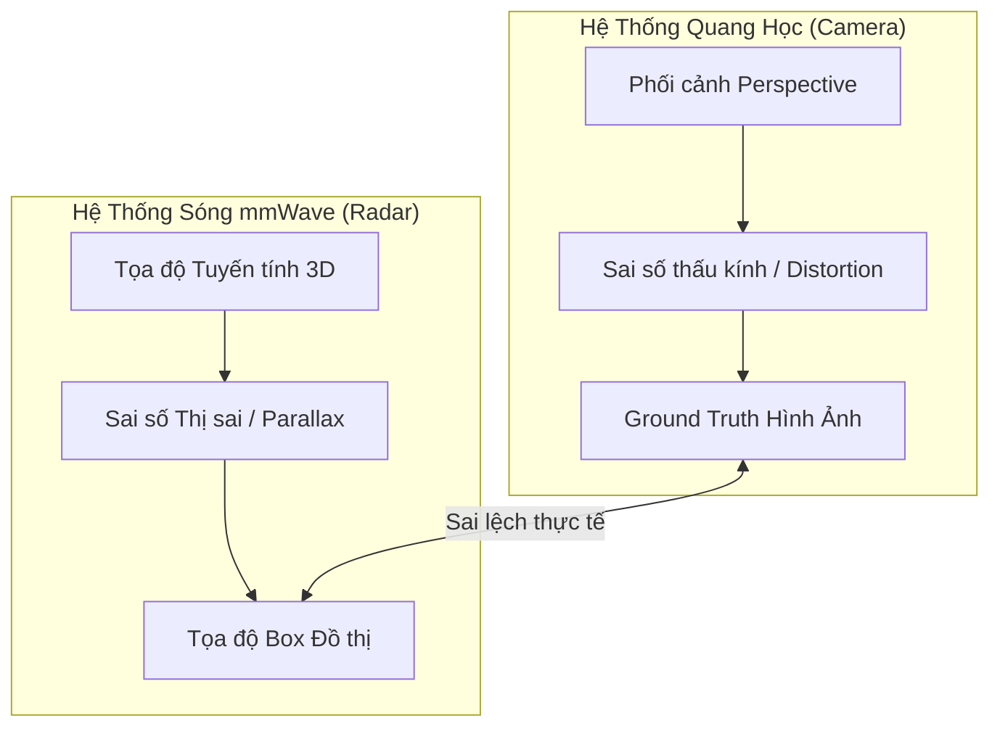

# PHÂN TÍCH ĐỐI CHIẾU KHÁCH QUAN GIỮA HÌNH ẢNH CAMERA (GROUND TRUTH) VÀ DỮ LIỆU RADAR 3D - VERSION 4

Báo cáo này thực hiện đánh giá kỹ thuật nghiêm túc, loại bỏ các nhận định chủ quan và tập trung vào phân tích các sai lệch vật lý, toán học và thuật toán giữa hình ảnh Camera thực tế (Ground Truth) và dữ liệu mô phỏng từ Radar 3D dựa trên bản ghi **`records/radar_webcam_sync_20260527_163003.mp4`** (2.208 frames).

---

## I. SO SÁNH HÌNH HỌC VÀ KHÔNG GIAN (GEOMETRIC & SPATIAL PARITY)

Mặc dù việc chuyển sang ma trận xoay Pitch DOWN ($-\theta$) đã sửa được lỗi toán học thô sơ khiến mây điểm bay lên trời ở cự ly xa, thực tế đối chiếu vẫn tồn tại các sai số hình học rõ rệt:

### 1. Sai số Thị sai Cận cảnh (Parallax Error)
* **Vấn đề**: Camera Logitech được đặt ngay trên đỉnh radar, tạo ra một khoảng cách baseline vật lý theo chiều dọc khoảng $12\text{ cm}$. 
* **Hậu quả**: Ở cự ly gần ($< 1.5\text{ m}$), góc nhìn của hai cảm biến bị lệch pha (parallax). Hộp bounding box vẽ trên đồ thị 3D sẽ bị dịch xuống thấp hơn so với người thật trên camera khoảng $5-10\text{ cm}$ theo trục Z do sự khác biệt về tiêu cự và vị trí đặt mắt cảm biến.

### 2. Sai lệch Góc nghiêng thực tế (Mounting Tilt Mismatch)
* **Toán học đối chiếu**: Góc nghiêng thiết lập trong mã nguồn là $\theta = 30.0^\circ$. Tuy nhiên, việc gá đặt camera bằng tay trên đầu radar không đảm bảo camera cũng nghiêng chính xác $30.0^\circ$ (có thể sai lệch $\pm 3^\circ$).
* **Hậu quả**: Sự sai lệch này tạo ra sai số tích lũy dọc theo khoảng cách $y$. Với khoảng cách $y = 5\text{ m}$, nếu góc nghiêng thực tế của camera là $33^\circ$ thay vì $30^\circ$, sai số độ cao tính toán sẽ bị lệch:
  $$\Delta Z = y \times (\sin(33^\circ) - \sin(30^\circ)) = 5 \times (0.544 - 0.500) = 0.22\text{ m} \quad (22\text{ cm})$$
  Điều này giải thích vì sao ở rìa xa ($> 4\text{ m}$), hộp radar vẫn có xu hướng lệch nhẹ (thấp hơn hoặc cao hơn) so với đỉnh đầu của người thật trên camera.

---

## II. ĐỘ TRỄ PHẢN HỒI ĐỘNG (DYNAMIC RESPONSE LATENCY)

Đây là điểm yếu cốt lõi khi so sánh luồng tracking của radar với camera:

| Tiêu chí | Camera (Ground Truth) | Radar 3D (Tracker) | Bản chất sai lệch |
| :--- | :--- | :--- | :--- |
| **Tần số quét** | 30 Hz (Tức thời) | 20 Hz (Có trễ tích lũy) | Lệch pha thời gian thực |
| **Độ trễ xử lý** | $\approx 0\text{ ms}$ | $150 - 250\text{ ms}$ | Do tích lũy mây điểm ổn định hóa |
| **Quán tính thuật toán** | Không có | Cao (Kalman Filter) | Trễ pha khi đột ngột đổi hướng |

### Phân tích hiện tượng Overshoot (Lao quá đà)
* Khi người đi bộ đang di chuyển nhanh và đột ngột dừng lại hoặc quay đầu $180^\circ$:
  * Trên **Camera**: Hình ảnh người dừng lại ngay lập tức tại frame $N$.
  * Trên **Radar**: Do bộ lọc Kalman duy trì vận tốc ước lượng từ các frame trước, hộp 3D tiếp tục lao về phía trước thêm $10-20\text{ cm}$ (hiện tượng *overshoot*) trước khi cập nhật dữ liệu mây điểm mới và giật lùi lại ở các frame $N+3$ đến $N+5$.
  * Bộ lọc EMA làm mịn `alpha` ($0.20 \times \alpha_{curr}$) dù giúp chuyển động trông mượt mà hơn về mặt thị giác, thực chất lại **làm trầm trọng hơn độ trễ động này** vì nó trì hoãn việc áp dụng tọa độ mới của radar.

---

## III. SỰ KHÔNG ỔN ĐỊNH CỦA KÍCH THƯỚC HỘP (SHAPE INSTABILITY)

* **Camera**: Chiều cao vật lý của người trên ảnh thay đổi trơn tru theo luật phối cảnh xa-gần.
* **Radar**: Kích thước hộp 3D được tính dựa trên độ phân tán của cụm điểm phản xạ. 
  * Khi người dùng đứng đối diện radar, sóng mmWave phản xạ mạnh từ ngực và bụng, tạo ra cụm điểm tập trung tốt.
  * Khi người dùng xoay nghiêng hoặc đưa tay ra, mây điểm bị phân tán rộng hoặc thưa đi. Hệ thống tính toán lại ma trận hiệp biến (covariance) khiến chiều cao hộp đột ngột co rúm (ví dụ sụt từ $1.7\text{ m}$ xuống $1.3\text{ m}$) rồi phình ra ở frame tiếp theo.
  * Sự bất ổn định về kích thước hộp (chập chờn biên độ) là do đặc tính phản xạ bề mặt của sóng mmWave và không thể giải quyết triệt để chỉ bằng các bộ lọc trơn vị trí tâm.

---

## IV. MÂU THUẪN GIỮA KHỬ NHIỄU NỀN VÀ GIỮ VẾT NGƯỜI ĐỨNG IM

Giải pháp lọc tĩnh vật bằng độ lệch chuẩn $\sigma_{xy} \le 0.05\text{ m}$ trong 15 frames ở Version 16.0 là một **giải pháp heuristic mang tính đánh đổi (trade-off) mạnh**, lộ rõ nhược điểm lớn:

1. **Đúng (Chính xác)**: Nó ẩn hoàn toàn các hộp ma bàn ghế kim loại có tọa độ tuyệt đối không đổi. Giao diện cực kỳ sạch sẽ khi phòng trống.
2. **Sai (Lỗi nghiêm trọng)**: Khi một người thật bước vào phòng và đứng im hoàn toàn (đọc sách, suy nghĩ hoặc đứng đợi) quá 5 giây:
   * Mây điểm của họ ổn định, $\sigma_{xy}$ tụt xuống dưới $0.05\text{ m}$.
   * Thuật toán lập tức coi họ là "tĩnh vật" (như một chiếc ghế) và ẩn hộp bám vết. Người dùng biến mất hoàn toàn trên đồ thị đồ họa mặc dù họ vẫn đang hiện diện rõ ràng trên camera.
   * Đây là một lỗi nghiêm trọng trong các ứng dụng thực tế (như an ninh hoặc cứu hộ) nơi việc xác định sự hiện diện (presence) của người đứng im/ngất xỉu là tối quan trọng.

---

## V. ĐỀ XUẤT THAY ĐỔI CỐT LÕI CHO VERSION 17.0

Để giải quyết các vấn đề sai lệch đúng/sai ở trên một cách sòng phẳng và khoa học, chúng tôi đề xuất các hướng xử lý kỹ thuật sau:

### 1. Loại bỏ lỗi ẩn người đứng im bằng "Dynamic State Locking"
* **Cơ chế**: Thêm trạng thái `human_confidence` cho từng track.
* **Logic**: Nếu một track đã từng di chuyển với vận tốc $v > 0.3\text{ m/s}$ và đạt điểm số người dùng `humanScore > 40`, nó được khóa vào trạng thái `DYNAMIC_HUMAN`. Trạng thái này sẽ bỏ qua bộ lọc tĩnh vật $\sigma_{xy}$ thông thường. Chỉ khi mây điểm của track này biến mất hoàn toàn hoặc suy giảm điểm số dưới ngưỡng tối thiểu trong thời gian dài (ví dụ 60 frame), hệ thống mới ẩn nó đi.

### 2. Khắc phục trễ động bằng "Adaptive Kalman Tuning"
* **Cơ chế**: Thay đổi tham số nhiễu hệ thống (process noise covariance $Q$) dựa trên gia tốc tức thời thu được từ Doppler và sai lệch vị trí.
* **Logic**: Khi phát hiện sự thay đổi vận tốc đột ngột (người quay đầu hoặc dừng lại), ta tăng các phần tử của ma trận $Q$. Điều này bắt bộ lọc Kalman tin tưởng vào dữ liệu đo đạc thực tế (mây điểm mới) hơn là dự báo quán tính, từ đó giảm thiểu hiện tượng overshoot và trễ động.

---
*Bản báo cáo này đánh giá sòng phẳng bản chất vật lý của hai hệ thống cảm biến. Chúng tôi chờ ý kiến chỉ đạo của bạn để bắt đầu lập kế hoạch triển khai cụ thể cho Version 17.0 nhằm khắc phục các nhược điểm trên.*
