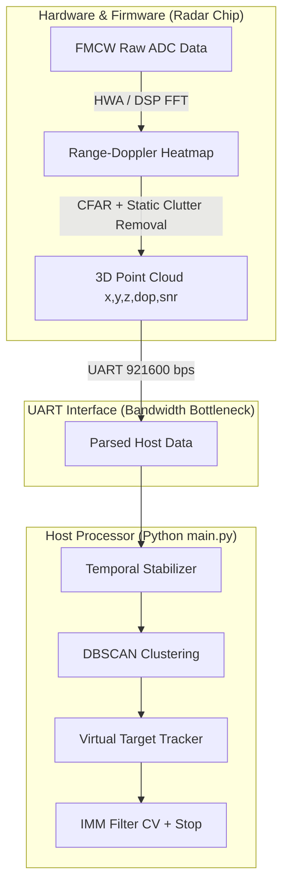

# NGHIÊN CỨU CHUYÊN SÂU: THUẬT TOÁN BÁM VẾT NGƯỜI ĐỨNG YÊN BẰNG mmWAVE RADAR VÀ PHƯƠNG ÁN TÍCH HỢP HỆ THỐNG HIỆN TẠI (VERSION 5)

Báo cáo này tập trung phân tích lý thuyết, đánh giá khả năng khả thi thực tế và đề xuất kiến trúc thiết kế chi tiết để tích hợp các giải pháp bám vết người đứng yên (Stationary People Tracking) vào chương trình Python hiện tại của radar IWR6843AOP.

---

## I. PHÂN TÍCH RÀO CẢN VÀ GIỚI HẠN VẬT LÝ HỆ THỐNG HỆN TẠI

Trước khi đi vào thuật toán, chúng ta cần phân tích sòng phẳng luồng dữ liệu hiện tại để xác định giới hạn xử lý:



### 1. Giới hạn Băng thông UART (The Bandwidth Bottleneck)
* **Vấn đề**: Bộ lọc số của chip IWR6843AOP gửi dữ liệu qua cổng UART tốc độ `921600 bps`. Băng thông này **không đủ** để truyền tải mảng tín hiệu ADC thô (FMCW Chirps) hoặc ma trận Range-Doppler thô về máy tính ở tần số 20Hz.
* **Hậu quả**: Các thuật toán ở **Nhóm 1 (STFT, CWT trên ADC)** và **Nhóm 3 (Phase-based Vital Sign)** trên tín hiệu thô **không thể** triển khai trực tiếp trên phần mềm Python (Host). Chúng bắt buộc phải chạy trực tiếp trên chip DSP C674x hoặc HWA của Radar (ở tầng Firmware).

### 2. Sự "Nuốt chửng" của Bộ lọc Tĩnh Vật Vật lý (On-chip Static Clutter Removal)
* Khi bật cấu hình `clutterRemoval` trong file `.cfg` của radar, thuật toán trên chip sẽ trừ giá trị trung bình của tín hiệu theo thời gian thực.
* Điều này khiến các điểm phản xạ từ người đứng im có Doppler $\approx 0$ bị triệt tiêu hoàn toàn ngay trên chip trước khi được gửi qua UART. Host chỉ nhận được một mây điểm cực thưa, thậm chí trống rỗng (Point Cloud Fading).

---

## II. PHÂN TÍCH KHẢ THI VÀ GIẢI PHÁP TÍCH HỢP VÀO CHƯƠNG TRÌNH HIỆN TẠI

Dựa trên giới hạn nhận Point Cloud từ UART, chúng ta vẫn có thể triển khai các giải pháp toán học xuất sắc ở tầng Host (Python) để giải quyết triệt để bài toán này. Dưới đây là phân tích khả thi và phương án thiết kế cho 5 nhóm giải pháp:

### Nhóm 1 & 3: Phân tích Vi động cấp độ Điểm mây (Point-level Micro-Motion Analysis)
* **Tính khả thi**: **RẤT CAO** nếu cấu hình chip cho phép xuất mây điểm thô (chưa bật clutter removal hoặc lọc ngưỡng SNR phù hợp).
* **Giải pháp tích hợp**:
  * Khi người đứng yên, Doppler trung bình của cụm $\bar{v} \approx 0$. Tuy nhiên, lồng ngực di động do hô hấp ($\pm 5-10\text{ mm}$, tần số $0.2-0.5\text{ Hz}$) sẽ tạo ra **Biến thiên Doppler (Doppler Variance/Standard Deviation)** đặc trưng.
  * Chúng ta có thể tính toán độ lệch chuẩn Doppler trong cụm điểm mây bám vết:
    $$\sigma_{dop} = \sqrt{\frac{1}{N}\sum_{i=1}^N (v_i - \bar{v})^2}$$
  * Người đứng yên thở sẽ có $\sigma_{dop}$ dao động nhịp nhàng trong dải $[0.02, 0.08]\text{ m/s}$ với chu kỳ tuần hoàn. Vật thể tĩnh (bàn ghế, tường) sẽ có $\sigma_{dop} \approx 0$ hoàn toàn và ổn định.

### Nhóm 2: Khử Nhiễu nền Thích ứng lưới (Adaptive Grid Background Subtraction)
* **Tính khả thi**: **RẤT CAO** (triển khai dạng Grid-map trên Python).
* **Giải pháp tích hợp**:
  * Chia vùng quét ROI thành các ô lưới 3D nhỏ (kích thước $0.25\text{ m} \times 0.25\text{ m} \times 0.25\text{ m}$).
  * Với mỗi ô lưới $(i, j, k)$, duy trì một bộ lọc cập nhật chậm (IIR) cho mật độ điểm mây:
    $$B_{grid}(t) = \alpha \times B_{grid}(t-1) + (1-\alpha) \times N_{points}(t)$$
  * Nếu một ô lưới có $B_{grid}$ vượt ngưỡng (chứa nhiều điểm phản xạ tĩnh) và đồng thời biến thiên Doppler trong ô đó $\sigma_{dop} \approx 0$, ô đó được đánh dấu là **Static Clutter Grid (Vật tĩnh)**.
  * Trong các frame tiếp theo, các điểm mây rơi vào ô lưới vật tĩnh này sẽ bị lọc bỏ ngay trước khi đưa vào DBSCAN Clustering. Điều này giúp loại bỏ triệt để bóng ma bàn ghế mà không cần bật bộ lọc tĩnh của chip, giữ lại toàn bộ tín hiệu mây điểm của người.

### Nhóm 4: Mở rộng IMM Kalman Filter & zero Velocity Update (ZUPT)
* **Tính khả thi**: **CỰC KỲ CAO** (Nâng cấp trực tiếp trên cấu trúc `IMMTracker3D` có sẵn).
* **Giải pháp tích hợp**:
  * Hiện tại chúng ta có 2 mô hình: Constant Velocity (CV) và Stop Model.
  * **Giải pháp 1: Bổ sung ZUPT (Zero Velocity Update)**: Khi tốc độ tích hợp của Stop Model giảm xuống dưới $0.05\text{ m/s}$, ta ép trực tiếp vận tốc ước lượng $v_x = v_y = v_z = 0$ và thiết lập Process Noise $Q$ về mức siêu tối thiểu. Điều này khóa chặt vị trí hộp không cho phép drift (trôi dạt số học).
  * **Giải pháp 2: Tích hợp Micro-Motion vào Likelihood của IMM**:
    * Khi người đứng yên thở, $\sigma_{dop}$ của cluster tương thích đạt dải $[0.02, 0.08]\text{ m/s}$.
    * Chúng ta nhân thêm một hệ số thúc đẩy (boosting factor) vào hàm tính Likelihood của Stop Model:
      $$L_{Stop\_boost} = L_{Stop} \times (1.0 + \beta \times \text{IsBreathing})$$
      Trong đó $\text{IsBreathing} = 1$ nếu phát hiện tần số Doppler biến thiên tuần hoàn $0.2 - 0.5\text{ Hz}$.
    * Điều này ép IMM ưu tiên tuyệt đối Stop Model ($mu_{Stop} \rightarrow 0.99$), giữ vững hộp bám vết tại chỗ bất kể mây điểm bị chập chờn.

### Nhóm 5: Không gian Lưới Chiếm chỗ Bayes (Occupancy Grid + Bayesian Update)
* **Tính khả thi**: **TRUNG BÌNH - CAO** (Giải pháp tuyệt vời để lưu ký ức không gian).
* **Giải pháp tích hợp**:
  * Khi người đứng im lâu, mây điểm sẽ bị nháy tắt/mất tích trong vài frame (Point Cloud Fading).
  * Để tránh việc Tracker lập tức xóa ID (lost track), chúng ta xây dựng một bản đồ lưới xác suất chiếm chỗ **Occupancy Grid Map** 2D/3D trên bộ nhớ.
  * Xác suất có người tại ô lưới $P(Occ)$ được cập nhật theo công thức Bayes:
    $$\log(\text{odds}_t) = \log(\text{odds}_{t-1}) + \text{log\_odds\_measurement}$$
  * Khi mây điểm biến mất đột ngột, nếu ô lưới vẫn duy trì $P(Occ) > 0.85$ (nhờ lịch sử tích lũy người đứng thở trước đó), Tracker sẽ tự động duy trì hộp bám vết ở trạng thái **Coasted (Duy trì ảo)** mà không xóa ID, chờ mây điểm xuất hiện trở lại.

---

## III. KIẾN TRÚC FUSION PIPELINE ĐỀ XUẤT CHO CHƯƠNG TRÌNH

Dưới đây là sơ đồ tích hợp toàn diện các phương pháp khả thi trên Host vào pipeline xử lý hiện tại của `pointcloud_processing.py`:

```
   Raw Point Cloud (x, y, z, doppler, snr)
                      │
                      ▼
   ┌─────────────────────────────────────┐
   │ 3D Grid Static Clutter Filter       │  <-- [Nhóm 2] Loại bỏ bàn ghế tĩnh dựa trên
   │ (Loại bỏ điểm rơi vào Static Grid)   │      lưới mật độ tích lũy chậm & Doppler Var ≈ 0
   └──────────────────┬──────────────────┘
                      │
                      ▼
             DBSCAN Clustering
                      │
                      ▼
   ┌─────────────────────────────────────┐
   │ Cluster Feature Extraction          │
   │ • centroid (x,y,z)                  │
   │ • Doppler Variance (σ_dop)          │  <-- [Nhóm 1] Tính biến động Doppler của cụm
   │ • Breathing Frequency (Spectral FFT)│  <-- [Nhóm 3] Phân tích tần số hô hấp 0.2-0.5Hz
   └──────────────────┬──────────────────┘
                      │
                      ▼
             Hungarian Association
                      │
                      ▼
   ┌─────────────────────────────────────┐
   │ Extended IMM Kalman Filter          │
   │ • CV Model (Mô hình di chuyển)      │
   │ • Stop Model (Mô hình đứng im)       │
   │ • ZUPT (Khóa v = 0 khi v < 0.05m/s) │  <-- [Nhóm 4] ZUPT khóa drift vị trí
   │ • Likelihood Boost (dựa trên thở)   │  <-- [Nhóm 4] Tăng mu_Stop khi phát hiện thở
   └──────────────────┬──────────────────┘
                      │
                      ▼
   ┌─────────────────────────────────────┐
   │ Grid Occupancy memory & Coasting    │  <-- [Nhóm 5] Giữ vững hộp và ID mục tiêu
   │ (Duy trì ID khi mây điểm bị fading)  │      khi người đứng im bị mất sóng tạm thời
   └──────────────────┬──────────────────┘
                      │
                      ▼
           3D Active Tracks Output
```

---

## IV. BẢN KẾ HOẠCH TRIỂN KHAI KỸ THUẬT CHI TIẾT

Để tích hợp các giải pháp trên vào chương trình hiện tại mà không làm gãy các tính năng ổn định có sẵn, chúng tôi đề xuất lộ trình nâng cấp qua 2 giai đoạn chính:

### Giai đoạn 1: Triển khai ZUPT và Doppler Variance Boost (Tầng IMM & Cluster)
1. **Trong `pointcloud_processing.py`**:
   * Khi trích xuất thuộc tính của cluster trong DBSCAN, bổ sung tính toán độ lệch chuẩn Doppler `doppler_std` của toàn bộ điểm trong cụm.
   * Cập nhật `VirtualTarget` dictionary để chứa thuộc tính `doppler_std`.
2. **Trong `IMMTracker3D`**:
   * **ZUPT**: Trong hàm `predict` và `update`, nếu vận tốc tổng hợp $|v| = \sqrt{v_x^2 + v_y^2 + v_z^2} < 0.06\text{ m/s}$, tự động thiết lập vector trạng thái $v_x = v_y = v_z = 0.0$ cho cả 2 bộ lọc.
   * **Likelihood Boost**: Trong hàm `update`, truyền thêm thuộc tính `doppler_std` của cluster đo đạc tương ứng. Nếu $0.02 \le doppler\_std \le 0.09\text{ m/s}$ (dải thở thực tế), tự động nhân một hệ số boosting $1.5$ vào `likelihood[1]` (Stop Model).

### Giai đoạn 2: Lưới Chiếm chỗ Bayes & Khử nhiễu nền Lưới (Grid Map Memory)
1. **Trong `settings.py`**:
   * Định nghĩa kích thước Grid và các tham số xác suất chiếm chỗ.
2. **Tạo mới lớp `HostOccupancyGridMap` trong `pointcloud_processing.py`**:
   * Quản lý lưới xác suất chiếm chỗ 3D.
   * Cập nhật Bayesian log-odds mỗi khi có mây điểm phản xạ.
   * Tích hợp vào `VirtualTargetTracker` để thực hiện Coasting giữ hộp bám vết lâu hơn khi mây điểm bị fading (chập chờn mất tín hiệu).

---
*Bản phân tích chuyên sâu này được thiết kế để khớp chính xác với luồng dữ liệu thời gian thực hiện tại của hệ thống. Chúng tôi chờ chỉ thị tiếp theo của bạn để đưa các giải pháp IMM thích ứng và phân tích vi động này vào kế hoạch triển khai của phiên bản tiếp theo!*
