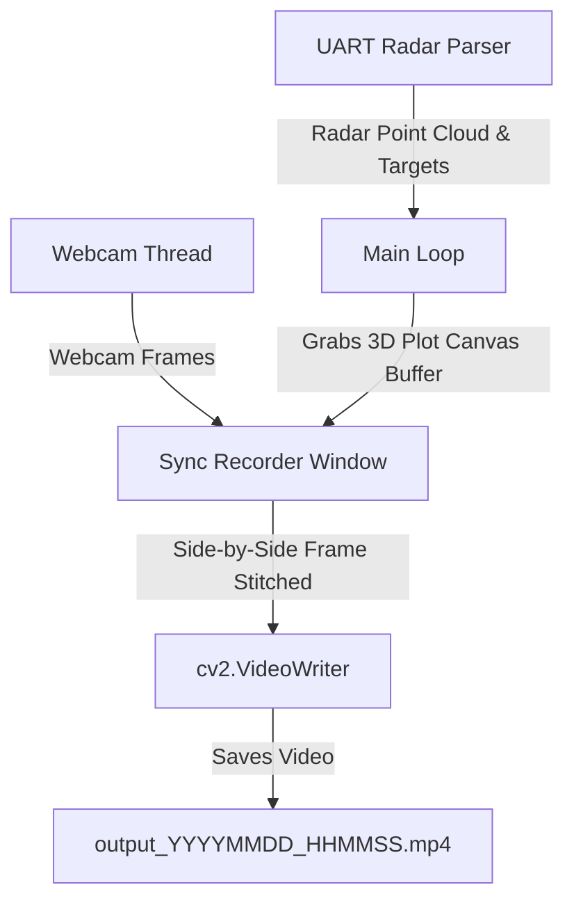

# KẾ HOẠCH TRIỂN KHAI v11.0 - TÍCH HỢP WEBCAM ĐỒNG BỘ VÀ TỰ ĐỘNG GHI HÌNH PHÂN TÍCH (SIDE-BY-SIDE VIDEO RECORDER)

Tài liệu này trình bày kế hoạch nâng cấp hệ thống lên **Version 11.0** nhằm đáp ứng hai yêu cầu phân tích cao cấp từ người dùng:
1. **Tích hợp Webcam thời gian thực**: Khởi chạy luồng webcam song song để ghi lại chuyển động vật lý thực tế của người được quét.
2. **Ghi hình cửa sổ mô phỏng 3D**: Tự động chụp lại khung hình của cửa sổ đồ họa 3D Matplotlib từ bộ đệm đồ họa (canvas buffer) mà không cần phần mềm ghi hình ngoài.
3. **Ghép đôi Side-by-Side thông minh**: Đồng bộ hóa khung hình webcam (bên trái) và khung hình radar 3D (bên phải) thành một video duy nhất dạng ghép đôi cạnh nhau, tự động lưu lại dưới dạng file video `.mp4` để phục vụ công tác phân tích điểm yếu của thuật toán bám đuổi.

> [!IMPORTANT]
> **Yêu cầu cài đặt thư viện**: Do chương trình cần xử lý ảnh và ghi video, người dùng cần cài đặt thư viện OpenCV bằng cách chạy lệnh sau trong Terminal trước khi khởi chạy:
> ```powershell
> pip install opencv-python
> ```

---

## 🔍 THIẾT KẾ KIẾN TRÚC & PHƯƠNG ÁN TRIỂN KHAI

Để đảm bảo hiệu năng tối đa cho luồng xử lý dữ liệu UART của Radar (độ trễ cực kỳ nhạy cảm), chúng tôi thiết kế giải pháp như sau:



### 1. Luồng Webcam riêng biệt (Threaded Webcam Capture)
* Sử dụng luồng chạy ngầm (`threading.Thread`) để đọc khung hình từ Webcam một cách độc lập.
* **Lợi ích**: Giúp tránh hiện tượng Webcam bị trễ (lag) làm nghẽn hoặc chặn luồng chính đang đọc UART và vẽ Matplotlib.

### 2. Ghi hình trực tiếp từ Bộ đệm Đồ họa (Buffer Grabbing)
* Thay vì chụp ảnh toàn màn hình máy tính (dễ bị đè/lỗi góc quay), chúng tôi trích xuất trực tiếp bộ đệm đồ họa RGB từ Matplotlib canvas:
  ```python
  fig.canvas.draw()
  rgba_buffer = fig.canvas.buffer_rgba()
  plot_img = np.asarray(rgba_buffer)[:, :, :3] # Cắt lấy kênh màu RGB
  ```
* **Lợi ích**: Khung hình ghi nhận cực kỳ sắc nét, độc lập với việc cửa sổ Matplotlib có bị thu nhỏ hay bị các cửa sổ khác trên hệ điều hành Windows đè lên hay không.

### 3. Đồng bộ hóa và Ghép Side-by-Side
* Ở mỗi khung hình vẽ đồ họa 3D, hệ thống sẽ lấy khung hình webcam mới nhất và ghép chúng thành một ảnh lớn có kích thước đồng nhất:
  $$\text{Frame}_{output} = [\text{Webcam Frame (Left)} \quad | \quad \text{Radar Plot (Right)}]$$
* Tự động thêm tem thời gian (Timestamp), số Frame, và chú thích lên góc video để người dùng dễ quan sát độ lệch pha (delay) giữa thực tế và radar.

---

## 📝 DANH SÁCH FILE THAY ĐỔI CHI TIẾT (PROPOSED CHANGES)

### 📄 [MODIFY] [settings.py](file:///c:/Users/Lirrak/Documents/Born%20Again/Radar%20Project/IWR6843AOP/People%20Tracking/settings.py)
* Bổ sung các tham số cấu hình Webcam và bộ ghi hình ở cuối file:
```python
# ============================================================
# WEBCAM & VIDEO RECORDING SETTINGS (Version 11.0)
# ============================================================
ENABLE_WEBCAM = True                # Bật/tắt webcam song song
WEBCAM_INDEX = 0                    # ID của camera (0 là camera mặc định)
WEBCAM_RESOLUTION = (640, 480)      # Độ phân giải webcam (Width, Height)

ENABLE_RECORDING = True             # Bật/tắt chế độ tự động ghi hình
RECORD_OUTPUT_DIR = "records"       # Thư mục lưu trữ video phân tích
RECORD_FPS = 15                     # Tốc độ khung hình của video lưu trữ
```

### 📄 [NEW] [sync_recorder.py](file:///c:/Users/Lirrak/Documents/Born%20Again/Radar%20Project/IWR6843AOP/People%20Tracking/sync_recorder.py)
* Tạo module quản lý webcam và ghi hình Side-by-Side:
```python
import os
import time
import datetime
import threading
import numpy as np
from settings import *

try:
    import cv2
    HAS_OPENCV = True
except ImportError:
    HAS_OPENCV = False

class SyncRecorder:
    def __init__(self):
        self.enabled = ENABLE_RECORDING and HAS_OPENCV
        self.webcam_enabled = ENABLE_WEBCAM and HAS_OPENCV
        self.cap = None
        self.writer = None
        self.webcam_frame = None
        self.running = False
        self.thread = None
        self.output_path = ""

    def start(self):
        if not HAS_OPENCV:
            print("[WARNING] OpenCV (cv2) is not installed! Webcam & Recording features are disabled.")
            print("[WARNING] Please run: pip install opencv-python")
            return

        if self.webcam_enabled:
            self.cap = cv2.VideoCapture(WEBCAM_INDEX)
            if not self.cap.isOpened():
                print(f"[WARNING] Cannot open webcam index {WEBCAM_INDEX}. Disabling webcam.")
                self.webcam_enabled = False
            else:
                self.cap.set(cv2.CAP_PROP_FRAME_WIDTH, WEBCAM_RESOLUTION[0])
                self.cap.set(cv2.CAP_PROP_FRAME_HEIGHT, WEBCAM_RESOLUTION[1])
                self.running = True
                self.thread = threading.Thread(target=self._webcam_loop, daemon=True)
                self.thread.start()
                print(f"[INFO] Webcam thread started successfully on camera index {WEBCAM_INDEX}.")

        if self.enabled:
            # Tạo thư mục records nếu chưa có
            os.makedirs(RECORD_OUTPUT_DIR, exist_ok=True)
            timestamp = datetime.datetime.now().strftime("%Y%m%d_%H%M%S")
            self.output_path = os.path.join(RECORD_OUTPUT_DIR, f"radar_webcam_sync_{timestamp}.mp4")
            
            # Kích thước khung hình Side-by-Side:
            # Webcam: 640 x 480
            # 3D Matplotlib: Resize về 640 x 480 để cân đối
            # Tổng chiều rộng = 640 + 640 = 1280, Chiều cao = 480
            fourcc = cv2.VideoWriter_fourcc(*'mp4v')
            self.writer = cv2.VideoWriter(self.output_path, fourcc, RECORD_FPS, (1280, 480))
            print(f"[INFO] Video recording initialized. Saving to: {self.output_path}")

    def _webcam_loop(self):
        while self.running:
            ret, frame = self.cap.read()
            if ret:
                # Đảo ảnh webcam (mirror) để thuận mắt nếu muốn, mặc định giữ nguyên
                self.webcam_frame = frame
            time.sleep(0.01)

    def write_frame(self, plot_img, frame_number=0):
        if not self.enabled or self.writer is None:
            return

        # 1. Chuẩn bị ảnh Webcam (Trái)
        if self.webcam_enabled and self.webcam_frame is not None:
            webcam_part = self.webcam_frame.copy()
        else:
            # Nếu không có webcam, tạo khung nền đen
            webcam_part = np.zeros((480, 640, 3), dtype=np.uint8)
            cv2.putText(webcam_part, "Webcam Disabled/Unavailable", (50, 240),
                        cv2.FONT_HERSHEY_SIMPLEX, 0.7, (0, 0, 255), 2)

        # Đảm bảo ảnh webcam đúng kích thước 640x480
        webcam_part = cv2.resize(webcam_part, (640, 480))

        # 2. Chuẩn bị ảnh Matplotlib 3D Plot (Phải)
        # plot_img nhận vào là RGB từ matplotlib buffer
        # Đổi định dạng từ RGB sang BGR để OpenCV ghi chính xác
        plot_bgr = cv2.cvtColor(plot_img, cv2.COLOR_RGB2BGR)
        plot_part = cv2.resize(plot_bgr, (640, 480))

        # 3. Ghép Side-by-Side
        combined_frame = np.hstack((webcam_part, plot_part))

        # 4. Vẽ Header/Thông tin đồng bộ lên Video
        timestamp_str = datetime.datetime.now().strftime("%Y-%m-%d %H:%M:%S.%f")[:-3]
        cv2.putText(combined_frame, f"REALITY (WEBCAM) | {timestamp_str}", (15, 25),
                    cv2.FONT_HERSHEY_SIMPLEX, 0.6, (0, 255, 0), 2)
        cv2.putText(combined_frame, f"RADAR 3D PLOT | Frame: {frame_number}", (655, 25),
                    cv2.FONT_HERSHEY_SIMPLEX, 0.6, (0, 255, 0), 2)

        # 5. Ghi vào video
        self.writer.write(combined_frame)

        # Hiển thị cửa sổ webcam nhỏ chạy song song nếu muốn
        if self.webcam_enabled and self.webcam_frame is not None:
            cv2.imshow("Webcam Live Feed (Radar Sync)", self.webcam_frame)
            cv2.waitKey(1)

    def stop(self):
        self.running = False
        if self.thread is not None:
            self.thread.join(timeout=1.0)

        if self.cap is not None:
            self.cap.release()

        if self.writer is not None:
            self.writer.release()
            print(f"[INFO] Video recording stopped and saved successfully to: {self.output_path}")

        if HAS_OPENCV:
            cv2.destroyAllWindows()
```

### 📄 [MODIFY] [main.py](file:///c:/Users/Lirrak/Documents/Born%20Again/Radar%20Project/IWR6843AOP/People%20Tracking/main.py)
* Tích hợp bộ ghi hình vào quy trình chạy chính:
```python
# Thêm import ở đầu file main.py
from sync_recorder import SyncRecorder

# Trong hàm main():
def main():
    # ... các đoạn code khởi tạo cũ ...
    
    # Khởi tạo bộ ghi hình đồng bộ
    recorder = SyncRecorder()
    recorder.start()
    
    try:
        while plt.fignum_exists(fig.number):
            # ... Đọc UART, phân tích TLV và bám đuổi mục tiêu ...
            
            if should_plot:
                # ... Cập nhật dữ liệu vẽ đồ họa ...
                update_3d_plot(...)
                
                # CHỤP HÌNH CANVAS VÀ GHI VIDEO SIDE-BY-SIDE (NEW)
                if recorder.enabled:
                    try:
                        # Trích xuất trực tiếp ảnh RGB từ bộ đệm đồ họa Matplotlib
                        fig.canvas.draw()
                        rgba_buffer = fig.canvas.buffer_rgba()
                        plot_img = np.asarray(rgba_buffer)[:, :, :3]
                        
                        # Ghi khung hình đồng bộ với số frame tương ứng
                        recorder.write_frame(plot_img, frame_number=last_frame_number)
                    except Exception as record_err:
                        print(f"[WARNING] Grab canvas error: {record_err}")
                
                last_plot_time = now
                
            plt.pause(0.001)
            time.sleep(0.001)
            
    except KeyboardInterrupt:
        print("\n[INFO] Stopped by user.")
    # ... các khối except khác ...
    finally:
        # Dừng luồng webcam và lưu file video an toàn (NEW)
        recorder.stop()
        
        # ... đóng kết nối UART cũ ...
```

---

## 🔬 KẾ HOẠCH XÁC MINH (VERIFICATION PLAN)

### 1. Kiểm tra môi trường & Thư viện
* Thực hiện cài đặt `opencv-python`:
  ```powershell
  pip install opencv-python
  ```
* Chạy chương trình kiểm tra import OpenCV:
  ```powershell
  python -c "import cv2; print('OpenCV version:', cv2.__version__)"
  ```

### 2. Kiểm thử vận hành thực tế
* Kết nối radar và chạy:
  ```powershell
  python main.py
  ```
* **Tiêu chuẩn kiểm thử đạt yêu cầu**:
  1. Cửa sổ "Webcam Live Feed (Radar Sync)" hiển thị song song với cửa sổ mô phỏng 3D Matplotlib của Radar.
  2. Khi di chuyển trước Webcam, chuyển động phản chiếu thời gian thực của webcam và sự thay đổi của các điểm/hộp 3D Radar diễn ra đồng thời.
  3. Khi kết thúc chương trình (ấn `Ctrl+C` hoặc tắt cửa sổ đồ họa):
     * Video `.mp4` được xuất thành công trong thư mục `records/`.
     * Xem lại video thấy rõ Webcam (bên trái) và Radar 3D (bên phải) chạy cực kỳ đồng hành, hiển thị rõ mốc thời gian thực và số frame để phục vụ đánh giá khuyết điểm của bộ lọc radar.
