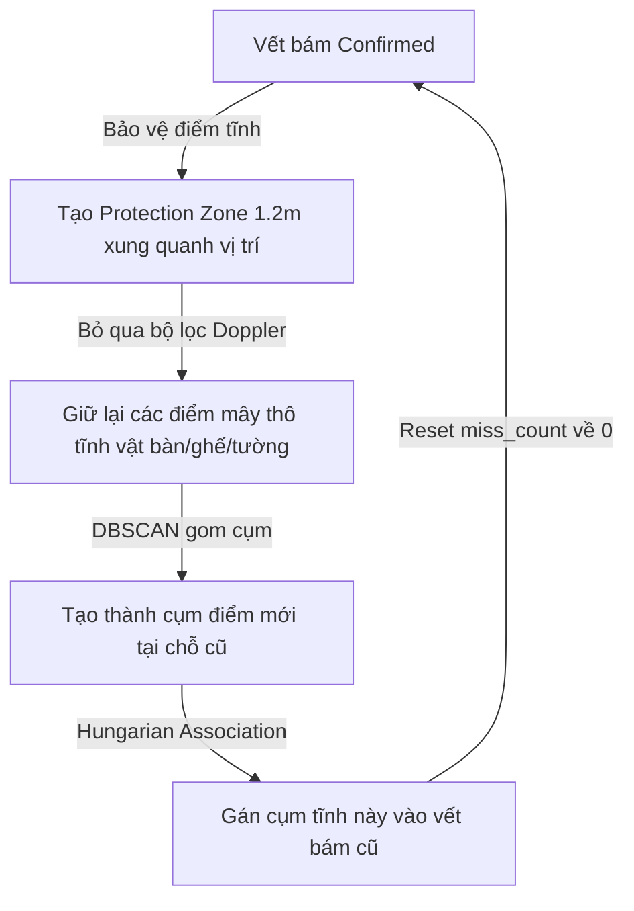

# KẾ HOẠCH TRIỂN KHAI v21.0 - GIẢI QUYẾT TRIỆT ĐỂ LỖI KHÓA CỨNG BÓNG MA TĨNH KHI NGƯỜI RỜI PHÒNG (DYNAMIC CLUTTER PROTECTION GATE)

Tài liệu này trình bày kế hoạch nâng cấp hệ thống lên **Version 21.0** để giải quyết lỗi "khóa cứng bóng ma" (room lock-on trap). Hiện tượng này xảy ra khi người dùng đứng im được bám vết, sau đó bước ra ngoài phòng nhưng radar vẫn tiếp tục vẽ human box đứng im tại chỗ cũ vô thời hạn.

---

## 🔍 PHÂN TÍCH VẤN ĐỀ VÀ PHƯƠNG ÁN NÂNG CẤP

### 1. Nguyên nhân cốt lõi của lỗi "Khóa cứng bóng ma tĩnh" (Lock-on trap feedback loop)
Lỗi này sinh ra từ một vòng lặp phản hồi ngược (feedback loop) vô tình giữa bộ lọc điểm tĩnh và trạng thái confirmed của tracker:



Khi bạn đi ra khỏi phòng quét:
1. Vết bám của bạn vẫn tạm thời ở trạng thái `confirmed`. Vị trí của nó được đưa vào danh sách `confirmed_positions` để bảo vệ điểm tĩnh.
2. Vì nằm trong danh sách bảo vệ, **tất cả điểm tĩnh vật của tường hoặc bàn ghế kim loại** trong bán kính `1.2` mét xung quanh vị trí cũ sẽ **không bị lọc bỏ**.
3. Các điểm tĩnh vật này được DBSCAN gom thành cụm và liên kết thành công với vết bám cũ, reset `miss_count = 0` và giữ cho vết bám `confirmed` mãi mãi tại đó, mặc dù bạn đã rời đi từ lâu!

---

## 💡 GIẢI PHÁP ĐỀ XUẤT: DYNAMIC CLUTTER PROTECTION GATE

Để phá vỡ vòng lặp phản hồi ngược này, chúng ta cần một cơ chế đánh giá thông minh: **Chỉ bảo vệ điểm tĩnh nếu mục tiêu thực sự là con người đang thở hoặc đang di chuyển.** Nếu mục tiêu đứng im nhưng không có hơi thở (Doppler variance $\approx 0$), ta lập tức **đóng cổng bảo vệ** tại vị trí đó!

### 1. Cơ chế hoạt động của Protection Gate (`pointcloud_processing.py`)
Trong hàm `track_and_build()`, khi xây dựng danh sách `confirmed_positions` để truyền vào `build_human_point_mask()`, chúng ta sẽ bổ sung bộ lọc điều kiện:
* **Điều kiện di chuyển**: Vận tốc tổng hợp của mục tiêu từ IMM Filter $|v| \ge 0.12\text{ m/s}$.
* **Điều kiện vi động hô hấp (Breathing)**: Độ lệch chuẩn Doppler của cụm điểm mục tiêu đạt dải nhịp thở sinh học `doppler_std >= 0.012`.
* **Toán học kiểm tra**:
  ```python
  confirmed_positions = []
  for tid, track_info in self.active_tracks.items():
      if track_info["state"] == "confirmed":
          k_state = track_info["kalman"].x
          vx, vy, vz = k_state[3], k_state[4], k_state[5]
          speed = np.sqrt(vx**2 + vy**2 + vz**2)
          
          features = track_info.get("features", {})
          if features is None:
              features = {}
          dop_std = features.get("doppler_std", 0.0)
          
          # Chỉ bảo vệ điểm tĩnh nếu mục tiêu đang di chuyển hoặc đứng im có thở/vi động (Version 21.0)
          is_moving = speed >= 0.12
          is_breathing = dop_std >= 0.012
          
          if is_moving or is_breathing:
              confirmed_positions.append(k_state[:2])
  ```

### 2. Phân tích kịch bản hoạt động:
* **Kịch bản A (Người đứng im thở)**: Bạn đứng im, `speed < 0.12` nhưng hơi thở tạo ra `dop_std = 0.03 >= 0.012`. Cổng bảo vệ mở, các điểm mây thở của bạn được giữ lại $\rightarrow$ **Tiếp tục bám vết ổn định**.
* **Kịch bản B (Người bước đi ra ngoài)**: Bạn bước đi, `speed >= 0.12`. Cổng bảo vệ mở và di chuyển theo chân bạn $\rightarrow$ **Bám vết di chuyển bình thường**.
* **Kịch bản C (Người đã rời phòng, chỉ còn bàn ghế tĩnh vật)**: Ngay khi bạn bước ra ngoài, mây điểm thở biến mất. Tại vị trí cũ chỉ còn bàn ghế/tường với `speed = 0.0` và `dop_std = 0.0 < 0.012`. Cổng bảo vệ lập tức **ĐÓNG LẠI** tại tọa độ này.
  * Bộ lọc điểm tĩnh `build_human_point_mask()` lập tức quét sạch toàn bộ điểm tĩnh vật của tường/bàn ghế tại chỗ cũ.
  * Cụm điểm biến mất, Tracker không còn cụm nào để liên kết $\rightarrow$ `miss_count` tăng dần $\rightarrow$ **Xóa sạch bóng ma tĩnh chỉ sau 1.5 giây!**

---

## 📝 DANH SÁCH FILE THAY ĐỔI CHI TIẾT (PROPOSED CHANGES)

### 📄 [MODIFY] [pointcloud_processing.py](file:///c:/Users/Lirrak/Documents/Born%20Again/Radar%20Project/IWR6843AOP/People%20Tracking/pointcloud_processing.py)
* **VirtualTargetTracker.track_and_build**: Thay thế vòng lặp trích xuất `confirmed_positions` đơn giản cũ bằng cơ chế **Dynamic Clutter Protection Gate** kiểm tra điều kiện di chuyển và hô hấp (`doppler_std`).

---

## 🔬 KẾ HOẠCH XÁC MINH (VERIFICATION PLAN)

### 1. Xác minh bám vết người đứng im
* Đứng im trước radar trong 30 giây để vết bám hoạt động bình thường.
* **Tiêu chuẩn vượt qua**: Hộp bám vết ID duy trì ổn định không bị mất dấu.

### 2. Xác minh xóa bóng ma khi rời phòng
* Sau khi được bám vết thành công lúc đứng im, bước nhanh ra khỏi tầm quét của radar.
* **Tiêu chuẩn vượt qua**:
  * Trên đồ thị 3D Matplotlib, hộp bám vết cũ **phải biến mất hoàn toàn** chỉ sau khoảng 1.5 - 2 giây (không còn hiện tượng khóa cứng vô hạn).
  * Kiểm tra tệp log CSV, mục `target_count` sụt về `0` và `active_target_ids` trống rỗng ngay sau khi rời đi.
