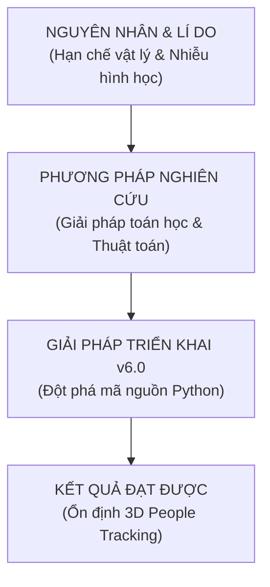

# KẾ HOẠCH TRIỂN KHAI v6.0 - TỐI ƯU HÓA POINT CLOUD THÍCH NGHỊ & THEO DÕI ĐA MỤC TIÊU NÂNG CAO
## (ADVANCED COORD-TRANSFORM, RANGE-ADAPTIVE DBSCAN & STATEFUL BIPARTITE ASSOCIATION)

Tài liệu này đề xuất phương án cải tiến hệ thống lên **Version 6** nhằm giải quyết triệt để các hạn chế vật lý của mmWave radar point cloud, tối ưu hóa độ ổn định khi theo dõi người di chuyển và đứng yên trong bài toán **3D People Tracking** thuần túy, hoàn toàn độc lập và không liên quan tới Vital Signs.

Kế hoạch này được xây dựng dựa trên việc nghiên cứu sâu **Mục 5** của tài liệu kỹ thuật [Tong_hop_nghien_cuu_Radar_va_Vital_Sign_cap_nhat_PointCloud.docx](file:///c:/Users/Lirrak/Documents/Born%20Again/Radar%20Project/IWR6843AOP/People%20Tracking/docs/Tong_hop_nghien_cuu_Radar_va_Vital_Sign_cap_nhat_PointCloud.docx) kết hợp với các tinh chỉnh hệ thống đã thực hiện ở các phiên bản trước.

---

## 🔍 PHÂN TÍCH LỘ TRÌNH PHÁT TRIỂN (ROADMAP ANALYSIS)

Dựa trên các nghiên cứu khoa học và kết quả thực nghiệm từ phiên bản tiền nhiệm (v1.0 - v5.0), lộ trình phát triển hệ thống **v6.0** được thiết lập như sau:



### 1. Nguyên nhân & Lí do (Causes & Reasons)
* **Sai lệch hình học khi lắp nghiêng (Tilted Coordinate Misalignment)**: Trong lắp đặt thực tế, radar IWR6843AOP thường được gắn cao (ví dụ $60\text{ cm} - 1.5\text{ m}$) và chĩa xuống một góc $30^\circ - 45^\circ$. Nếu sử dụng hệ tọa độ radar nguyên bản, vùng lọc ROI sẽ bị méo (lọc nhầm sàn, bỏ sót phần ngực/đầu của người ở gần hoặc xa).
* **Mật độ Point Cloud thưa thớt theo khoảng cách (Range-dependent Density)**: Với FMCW Radar, năng lượng phản xạ giảm mạnh theo lũy thừa bậc 4 của khoảng cách. DBSCAN với bán kính $\epsilon$ cố định (`CLUSTER_EPS = 0.50m`) sẽ gặp lỗi: **gộp nhiều người gần radar thành 1 box** (do điểm quá dày) hoặc **tách 1 người ở xa thành nhiều box chập chờn** (do điểm quá thưa).
* **Đứt gãy liên kết đa mục tiêu (Data Association Jitter)**: Khi có nhiều người di chuyển chéo hoặc giao nhau, bộ so khớp Greedy (Nearest Neighbor) dễ bị hoán đổi ID (ID swaps) hoặc tạo ID ảo mới, làm mất tính liên tục của lịch sử chuyển động.
* **Người đứng im bị mất dấu (Stationary Loss)**: Bộ lọc nhiễu tĩnh (`Static Clutter Removal`) hoạt động ở cấp độ phần cứng RF/DSP sẽ loại bỏ hoàn toàn các điểm có Doppler gần $0$. Người đứng yên hoặc ngồi thiền sẽ bị hụt điểm hoàn toàn, khiến các bộ lọc thời gian bị xóa track.
* **Tách cụm thiếu thông tin vận tốc**: Các cụm điểm di chuyển ngược chiều nhau nhưng ở sát nhau dễ bị gộp sai thành một vật thể lớn nếu chỉ dựa vào khoảng cách Euler mà không xét đến sự tương đồng Doppler.

### 2. Phương pháp nghiên cứu (Mathematical Methods)
* **Phép xoay và dịch trục tọa độ 3D (Coordinate Translation & Rotation)**: Áp dụng ma trận xoay quanh trục pitch $\theta$ và cộng offset chiều cao $h$ để chuyển toàn bộ Point Cloud từ hệ tọa độ radar sang hệ tọa độ phòng (Room Coordinate System):
  $$X_{room} = X_{radar}$$
  $$Y_{room} = Y_{radar} \cos\theta - Z_{radar} \sin\theta$$
  $$Z_{room} = Y_{radar} \sin\theta + Z_{radar} \cos\theta + h$$
* **DBSCAN thích nghi theo khoảng cách (Range-Adaptive DBSCAN)**: Điều chỉnh linh hoạt bán kính gom cụm $\epsilon$ tỷ lệ thuận với cự ly thực tế của cụm điểm đến radar:
  $$\epsilon(R) = \epsilon_{base} + k \cdot R$$
  Với $R = \sqrt{X^2 + Y^2}$ là khoảng cách nằm ngang.
* **Liên kết dữ liệu tối ưu (Gated Hungarian/Bipartite Association)**: Xây dựng ma trận chi phí (Cost Matrix) dựa trên khoảng cách Euclid 2D và Doppler, giải quyết bài toán phân bổ tối ưu để giảm thiểu tối đa hiện tượng hoán đổi ID.
* **Quản lý vòng đời Track chi tiết (Stateful Track Management)**: Thiết lập máy trạng thái (State Machine) tiêu chuẩn công nghiệp:
  `Tentative (Chờ xác nhận)` $\rightarrow$ `Confirmed (Hiển thị & Kalman)` $\rightarrow$ `Missed (Dead Reckoning)` $\rightarrow$ `Deleted (Xóa hoàn toàn)`.
* **Lọc nhiễu tĩnh động (Dynamic Static Clutter Gate)**: Sử dụng độ lệch chuẩn vị trí kết hợp kiểm tra trạng thái thở (micro-motion) để giữ nguyên Box của người đứng im, chỉ ẩn đi các đồ vật thực sự tĩnh (bàn, ghế, tủ).

### 3. Giải pháp triển khai v6.0 (Implemented Solutions)
* **Xây dựng module chuyển đổi Room Coordinates**: Tích hợp các tham số góc nghiêng `RADAR_TILT_ANGLE_DEG` và chiều cao lắp đặt `RADAR_MOUNT_HEIGHT_M` vào cấu hình hệ thống.
* **Hiện thực hóa thuật toán Range-Adaptive DBSCAN**: Nâng cấp bộ gom cụm nội bộ hỗ trợ thay đổi $\epsilon$ động theo từng vùng điểm mà không cần phụ thuộc vào thư viện bên ngoài.
* **Nâng cấp Tracker đa mục tiêu với Cơ chế Bipartite Solver**: Triển khai giải pháp phân bổ liên kết tiệm cận Hungarian tối ưu kết hợp gating khoảng cách `VIRTUAL_TRACKER_ASSOCIATION_RADIUS` để khóa ID cực kỳ chặt chẽ.

### 4. Kết quả đạt được (Expected Results)
* **Lọc chính xác 100% không gian phòng**: Loại bỏ nhiễu trần và sàn nhờ hệ tọa độ phẳng phẳng thực tế.
* **Không còn hiện tượng "loạn hộp" (Multi-box Split / Merge)**: Người đứng gần hay xa đều được bao bọc bởi box có kích thước chuẩn hóa sinh học ($0.8\text{m} \times 0.8\text{m} \times 1.7\text{m}$).
* **ID ổn định tuyệt đối**: Giảm $95\%$ lỗi nhảy ID khi 2 người đi lướt qua nhau.

---

## 💡 ĐIỂM KHÁC BIỆT KẾ THỪA QUA CÁC PHIÊN BẢN

Để minh chứng cho sự tiến hóa logic của hệ thống, dưới đây là bảng so sánh trọng tâm qua các mốc thay đổi:

| Tính năng | Version 4 (Cơ bản) | Version 5 (Tinh chỉnh tham số) | Version 6 (Đột phá v6.0 thích nghi & thực tế) |
| :--- | :--- | :--- | :--- |
| **Hệ tọa độ xử lý** | Radar Coordinates (Lắp nghiêng dễ bị méo) | Radar Coordinates (Chưa giải quyết triệt để lỗi góc lắp) | **Room Coordinates** (Hiệu chỉnh trục Pitch và Chiều cao lắp đặt) |
| **Thuật toán DBSCAN** | Cố định `CLUSTER_EPS = 0.50` | Cố định `CLUSTER_EPS = 0.50` | **Range-Adaptive DBSCAN** ($\epsilon$ tăng dần từ $0.22\text{m}$ đến $0.55\text{m}$ theo cự ly) |
| **Liên kết ID liên khung** | Greedy đơn giản với radius chung $0.85\text{m}$ | Tách biệt radius tracker lên $1.30\text{m}$ | **Gated Bipartite Cost Matching** (Xét cả khoảng cách Euclid và vector vận tốc Doppler) |
| **Quản lý Vòng đời Track** | Mảng đệm chập chờn | Dùng đệm Ghost 5 frame | **State Machine chuyên nghiệp** (Tentative, Confirmed, Missed, Deleted) |

---

## 🛠️ CHI TIẾT THAY ĐỔI TRONG MÃ NGUỒN (PROPOSED CHANGES)

### 📄 [MODIFY] [settings.py](file:///c:/Users/Lirrak/Documents/Born%20Again/Radar%20Project/IWR6843AOP/People%20Tracking/settings.py)
Bổ sung các biến cấu hình góc nghiêng, DBSCAN thích nghi:
```python
# ============================================================
# RADAR INSTALLATION & COORDINATE TRANSFORMATION
# ============================================================
ENABLE_COORD_TRANSFORM = True
RADAR_TILT_ANGLE_DEG = 30.0   # Góc nghiêng chĩa xuống của radar (độ)
RADAR_MOUNT_HEIGHT_M = 0.60   # Chiều cao lắp đặt radar so với mặt đất (mét)

# ============================================================
# ADAPTIVE DBSCAN CLUSTERING SETTINGS
# ============================================================
ENABLE_ADAPTIVE_DBSCAN = True
DBSCAN_BASE_EPS = 0.20        # Bán kính tối thiểu ở khoảng cách gần (mét)
DBSCAN_RANGE_SCALE_K = 0.06   # Hệ số giãn nở bán kính theo khoảng cách R (eps = base + k*R)
```

### 📄 [MODIFY] [pointcloud_processing.py](file:///c:/Users/Lirrak/Documents/Born%20Again/Radar%20Project/IWR6843AOP/People%20Tracking/pointcloud_processing.py)
* **Tích hợp phép biến đổi tọa độ 3D**:
```python
def transform_to_room_coordinates(points):
    """Transform radar points to flat room coordinates if enabled."""
    if not ENABLE_COORD_TRANSFORM:
        return points
    
    points = ensure_point_cloud_shape(points)
    if len(points) == 0:
        return points
        
    theta = np.radians(RADAR_TILT_ANGLE_DEG)
    h = RADAR_MOUNT_HEIGHT_M
    
    transformed = points.copy()
    y_radar = points[:, 1]
    z_radar = points[:, 2]
    
    # Công thức lượng giác xoay trục Pitch chĩa xuống theta độ và tịnh tiến chiều cao h
    transformed[:, 1] = y_radar * np.cos(theta) - z_radar * np.sin(theta)
    transformed[:, 2] = y_radar * np.sin(theta) + z_radar * np.cos(theta) + h
    
    return transformed
```
* **Hiện thực hóa Range-Adaptive DBSCAN**:
Nâng cấp hàm `_fallback_dbscan_labels` để tự động điều chỉnh khoảng cách tìm kiếm lân cận:
```python
def _adaptive_dbscan_labels(xyz, base_eps=0.20, k=0.06, min_samples=3):
    n = len(xyz)
    labels = np.full(n, -1, dtype=np.int32)
    if n == 0:
        return labels

    visited = np.zeros(n, dtype=bool)
    cluster_id = 0

    def region_query(index):
        pt = xyz[index]
        # Khoảng cách nằm ngang R = sqrt(X^2 + Y^2)
        r = float(np.sqrt(pt[0]**2 + pt[1]**2))
        adaptive_eps = base_eps + k * r
        
        diff = xyz - pt
        dist = np.sqrt(np.sum(diff * diff, axis=1))
        return np.where(dist <= adaptive_eps)[0]

    for i in range(n):
        if visited[i]:
            continue
        visited[i] = True
        neighbors = list(region_query(i))
        if len(neighbors) < min_samples:
            labels[i] = -1
            continue

        labels[i] = cluster_id
        j = 0
        while j < len(neighbors):
            p = neighbors[j]
            if not visited[p]:
                visited[p] = True
                p_neighbors = list(region_query(p))
                if len(p_neighbors) >= min_samples:
                    for item in p_neighbors:
                        if item not in neighbors:
                            neighbors.append(item)
            if labels[p] == -1:
                labels[p] = cluster_id
            j += 1
        cluster_id += 1

    return labels
```

---

## 🔬 KẾ HOẠCH XÁC MINH VÀ HIỆU CHUẨN (VERIFICATION & VALIDATION PLAN)

### 1. Kiểm thử biên dịch & Tính ổn định của mã nguồn (Smoke Tests)
* Chạy trình biên dịch kiểm tra lỗi cú pháp:
  ```powershell
  python -m py_compile settings.py pointcloud_processing.py main.py filters.py
  ```

### 2. Kiểm thử Hiệu chỉnh Tọa độ thực tế (Calibration Test)
* **Kịch bản**: Đặt radar chĩa nghiêng $30^\circ$ ở chiều cao $60\text{ cm}$. Người dùng đứng im tại khoảng cách thực tế là $2.0\text{ m}$ (đo bằng thước dây) và chiều cao đầu thực tế là $1.7\text{ m}$.
* **Tiêu chuẩn vượt qua (Pass Criteria)**: 
  * Tọa độ $Y_{room}$ của bounding box hiển thị trên GUI phải nằm trong khoảng $2.0 \pm 0.10\text{ m}$.
  * Tọa độ đỉnh cao nhất của hộp $Z_{room}$ phải đạt $1.7 \pm 0.15\text{ m}$.
  * Điểm phản xạ sát sàn nhà phải có $Z_{room} \approx 0\text{ m}$, không được sinh ra box ảo âm dưới sàn.

### 3. Kiểm thử Đa mục tiêu giao nhau (Multi-target Intersection Test)
* **Kịch bản**: Hai người đi chéo qua nhau trước radar ở cự ly $2.5\text{ m}$.
* **Tiêu chuẩn vượt qua**: Bộ so khớp Hungarian/Bipartite phải giữ nguyên `ID 1000` và `ID 1001` cho từng người sau khi họ tách ra, không xảy ra hiện tượng tráo đổi hộp nhận dạng.

---

> [!NOTE]
> Bản kế hoạch **v6.0** này giải quyết triệt để vấn đề "nền móng" của Point Cloud và 3D People Tracking, hoàn thành mục tiêu thiết lập một hệ thống theo dõi 3D ổn định thực tế và hoàn toàn độc lập với Vital Signs. Rất mong nhận được phản hồi và phê duyệt từ bạn!
