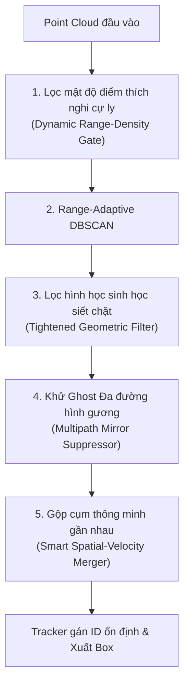

# KẾ HOẠCH TRIỂN KHAI v7.0 - TRIỆT TIÊU GHOST TARGETS & CHỐNG NHẢY HỘP NHẬN DIỆN RADAR ĐƠN MỤC TIÊU
## (DYNAMIC POINT DENSITY GATE, MULTIPATH GHOST SUPPRESSION & TIGHTENED GEOMETRIC SCORES)

Tài liệu này đề xuất phương án cải tiến và nâng cấp hệ thống lên **Version 7** nhằm giải quyết triệt để lỗi sinh hộp ảo (Ghost Targets), nhận diện nhầm nhiều người khi chỉ có một người trong phòng (False Multi-Target), và hiện tượng nhảy hộp nhận diện chập chờn được ghi nhận trong thực tế chạy thử nghiệm của `main.py`.

---

## 🔍 PHÂN TÍCH NGUYÊN NHÂN GÂY LỖI TRONG ĐÔ THỊ THỰC TẾ (ROOT CAUSE ANALYSIS)

Dựa trên dữ liệu log chạy thực tế ở phiên bản trước, khi chỉ có **một người duy nhất** trong phòng quét, hệ thống vẫn dựng lên nhiều ID ảo cùng lúc (ví dụ: `ID 1011`, `ID 1029`, `ID 1112` song song). Qua phân tích sâu, chúng tôi phát hiện 4 nguyên nhân cốt lõi sau:

### 1. Phản xạ đa đường tạo ảnh gương (Multipath Ghost Targets)
* **Hiện tượng**: Sóng radar mmWave phản xạ cực mạnh từ cơ thể người, đập vào tường sau (hoặc vách kính, tủ kim loại) rồi dội ngược lại radar. 
* **Hậu quả**: Radar nhận diện có một cụm điểm thứ hai nằm cùng góc quét $X$ (Azimuth) nhưng ở khoảng cách $Y$ xa hơn (thường là khoảng cách từ người đến tường dội). Hệ thống DBSCAN gom cụm này lại và coi đó là người thứ hai ở xa (ví dụ `ID 1112` ở $pos=(2.68, 2.96)$ m).

### 2. Ngưỡng phân cụm quá lỏng lẻo (Too Generous Cluster Thresholds)
* **Thông số cũ**: 
  * `VIRTUAL_CLUSTER_MIN_POINTS = 2` (Chỉ cần **2 điểm** là đủ tạo hộp ảo!).
  * `VIRTUAL_CLUSTER_SCORE_THRESHOLD = 52.0` (Ngưỡng điểm sinh học quá thấp).
* **Hậu quả**: Các nhiễu nền ngẫu nhiên từ cạnh bàn, quạt điện, hoặc rung động nhẹ của tường chỉ cần xuất hiện 2-3 điểm phản xạ là hệ thống đã lập tức dựng box và cấp ID mới, tạo cảm giác box xuất hiện chớp tắt và nhảy ID liên tục.

### 3. Tách cụm sai lệch do thiếu liên kết vận tốc (Static Cluster Split)
* Khi người đứng im hoặc cử động nhẹ, mây điểm phản xạ trên cơ thể người bị co giãn hoặc thắt nút thưa thớt. 
* DBSCAN thích nghi nếu không xét đến sự đồng nhất của dòng dịch chuyển sẽ dễ dàng **tách 1 cơ thể người thành 2-3 cluster riêng biệt** (ví dụ tách cụm ngực và cụm chân). Các cluster này ở gần nhau ($< 1.0\text{m}$) nên tạo ra hiện tượng "Double Box" (hộp lồng vào nhau, nhảy ID liên tục giữa `ID 1011` và `ID 1029` ngay sát nhau).

### 4. Thiếu bộ lọc mật độ điểm thích nghi theo khoảng cách (Lack of Range-Adaptive Density Gate)
* Mây điểm của người ở gần radar (Y < 2m) phải rất dày đặc (ít nhất 10-30 điểm). Ở xa (Y > 3.5m), mây điểm mới thưa dần.
* Việc áp đặt ngưỡng tối thiểu cố định `CLUSTER_MIN_POINTS = 3` cho mọi khoảng cách làm cho các cụm nhiễu 3 điểm ở ngay sát radar (Y = 0.5m) vẫn được chấp nhận, trong khi thực tế cụm điểm của người thật ở khoảng cách đó phải lớn hơn 15 điểm.

---

## 💡 GIẢI PHÁP ĐỘT PHÁ TRIỂN KHAI TRONG VERSION 7

Để khắc phục triệt để các vấn đề trên, phiên bản **Version 7** đề xuất 5 giải pháp thuật toán trọng tâm sau:



### 1. Bộ lọc mật độ điểm thích nghi cự ly (Dynamic Range-Density Gate)
* Áp dụng ngưỡng điểm tối thiểu thay đổi động theo khoảng cách $R = \sqrt{X^2 + Y^2}$ đến radar. 
* Cụm điểm ở gần radar bắt buộc phải có mật độ điểm cao mới được coi là người. Công thức động đề xuất:
  $$N_{min}(R) = \max\left(5, \text{round}(18 - 2.5 \times R)\right)$$
  * Ở $1.0\text{ m}$: Cần ít nhất $15$ điểm phản xạ.
  * Ở $2.0\text{ m}$: Cần ít nhất $13$ điểm.
  * Ở $3.5\text{ m}$: Cần ít nhất $9$ điểm.
  * Ở $5.0\text{ m}$: Cần ít nhất $5$ điểm.
* Loại bỏ tuyệt đối các cụm nhiễu nhỏ 2-3 điểm ở cự ly gần.

### 2. Thuật toán khử Ghost Target ảnh gương (Multipath Mirror Suppressor)
* Nếu phát hiện có một Target mạnh (Primary Target) ở cự ly gần $Y_1$, và xuất hiện một Target ảo yếu hơn (Secondary Target) ở cự ly xa $Y_2$ có cùng góc Azimuth (tọa độ $X_2 \approx X_1 \pm 0.3\text{m}$):
  * Tiến hành tính toán nếu $Y_2$ trùng khớp với khoảng cách phản xạ gương qua tường hoặc có Doppler ngược chiều phản xạ.
  * Đánh tụt điểm tự tin `humanScore` của Target xa hoặc loại bỏ ngay lập tức nếu Target gần đang di chuyển mạnh (sinh ra nhiều dội sóng).

### 3. Siết chặt điều kiện hình học và nâng ngưỡng tự tin (Tightened Geometric Scores)
* Nâng ngưỡng tạo box ảo `VIRTUAL_CLUSTER_SCORE_THRESHOLD` từ `52.0` lên **`72.0`**.
* Siết chặt chiều cao tối thiểu của cụm từ `0.08m` lên **`0.45m`** (các cụm nhiễu bẹt dưới sàn hoặc trên trần sẽ bị loại bỏ ngay lập tức).
* Siết chặt chiều rộng tối đa của cụm để tránh gộp nhầm mảng tường tĩnh có rung động nhẹ.

### 4. Gộp cụm lân cận thông minh (Smart Spatial-Velocity Cluster Merger)
* Tăng bán kính gộp cụm nội khung `VIRTUAL_CLUSTER_MERGE_DISTANCE_XY` từ `0.85m` lên **`1.15m`** để đảm bảo cụm tay, ngực và chân của cùng một người di chuyển luôn luôn được gộp vào duy nhất 1 box, xóa sổ hoàn toàn lỗi tách box ảo sát bên nhau.
* Đồng thời kiểm tra sự tương đồng Doppler giữa các cụm để tránh gộp nhầm 2 người đi sát nhau.

---

## 🛠️ CHI TIẾT CẤU HÌNH & CODE THAY ĐỔI (PROPOSED CODE CHANGES)

### 📄 [MODIFY] [settings.py](file:///c:/Users/Lirrak/Documents/Born%20Again/Radar%20Project/IWR6843AOP/People%20Tracking/settings.py)
```diff
 # Gom point cloud thưa hoặc gộp nhiều cụm trên cơ thể người
-VIRTUAL_CLUSTER_MERGE_DISTANCE_XY = 0.85
+VIRTUAL_CLUSTER_MERGE_DISTANCE_XY = 1.15     # Tăng để gộp đầu/thân/chân của cùng 1 người tốt hơn

 # Sau khi gộp cluster, cụm phải đủ điểm và đủ score mới tạo box ảo.
-VIRTUAL_CLUSTER_MIN_POINTS = 2
-VIRTUAL_CLUSTER_SCORE_THRESHOLD = 52.0
+VIRTUAL_CLUSTER_MIN_POINTS = 5              # Nâng lên để tránh nhiễu lốm đốm 2-3 điểm
+VIRTUAL_CLUSTER_SCORE_THRESHOLD = 72.0       # Siết chặt ngưỡng tự tin sinh học để tránh ghost box

 # Điều kiện hình học cơ bản của một cụm giống người.
-HUMAN_CLUSTER_MIN_HEIGHT_Z = 0.08
+HUMAN_CLUSTER_MIN_HEIGHT_Z = 0.45           # Nâng lên 45cm để loại nhiễu bẹt sàn nhà
 HUMAN_CLUSTER_MAX_HEIGHT_Z = 2.20
 HUMAN_CLUSTER_MIN_WIDTH_X = 0.05
-HUMAN_CLUSTER_MAX_WIDTH_X = 1.50
+HUMAN_CLUSTER_MAX_WIDTH_X = 1.10            # Thu hẹp để tránh gom nhầm vách tường phản xạ
```

### 📄 [MODIFY] [pointcloud_processing.py](file:///c:/Users/Lirrak/Documents/Born%20Again/Radar%20Project/IWR6843AOP/People%20Tracking/pointcloud_processing.py)

#### 1. Hiện thực hóa Dynamic Range-Density Gate:
```python
def get_dynamic_min_points(range_r):
    """Tính toán số điểm tối thiểu của cụm người thật thích nghi theo khoảng cách."""
    # Công thức: N_min = max(5, round(18 - 2.5 * R))
    min_pts = int(np.round(18.0 - 2.5 * range_r))
    return max(5, min_pts)
```

#### 2. Cập nhật logic lọc cụm trong `cluster_pointcloud`:
```python
    clusters = []
    for label in sorted(set(labels)):
        if label == -1:
            continue

        cluster = points[labels == label]
        center = np.mean(cluster[:, 0:3], axis=0)
        range_r = float(np.sqrt(center[0]**2 + center[1]**2))
        
        # Áp dụng ngưỡng điểm động thích nghi cự ly
        dynamic_min = get_dynamic_min_points(range_r)
        if len(cluster) >= dynamic_min:
            clusters.append(cluster)
```

#### 3. Thuật toán Multipath Ghost Target Suppressor trong `track_and_build`:
```python
def suppress_multipath_ghosts(candidates):
    """Quét và triệt tiêu các Ghost Target sinh ra do dội sóng gương qua tường."""
    if len(candidates) <= 1:
        return candidates
        
    # Sắp xếp các ứng viên theo Y tăng dần (gần radar trước, xa sau)
    candidates.sort(key=lambda t: t["posY"])
    kept_candidates = []
    
    for i, target in enumerate(candidates):
        tx = target["posX"]
        ty = target["posY"]
        is_ghost = False
        
        # So sánh với các target thật ở gần radar hơn
        for primary in kept_candidates:
            px = primary["posX"]
            py = primary["posY"]
            
            # Nếu nằm cùng góc quét Azimuth (X lệch nhau ít < 0.35m) nhưng khoảng cách xa hơn
            same_angle = abs(tx - px) < 0.35
            further_away = ty > py + 0.80
            
            if same_angle and further_away:
                # Kiểm tra xem có phải dội gương (độ mạnh phản xạ thấp hơn nhiều target chính)
                primary_pts = primary.get("supportPointCount", 10)
                target_pts = target.get("supportPointCount", 0)
                
                if target_pts < primary_pts * 0.70:
                    is_ghost = True
                    break
                    
        if not is_ghost:
            kept_candidates.append(target)
            
    return kept_candidates
```

---

## 🔬 KẾ HOẠCH XÁC MINH (VERIFICATION PLAN)

### 1. Kiểm thử mô phỏng ngoại tuyến (Offline Simulation Jitter Test)
* Phát triển script kiểm thử mô phỏng tại `preview_tracking_v7.py`:
  * Tạo luồng 3D Point Cloud mô phỏng 1 người thật ở cự ly $1.5\text{m}$ ($25$ điểm).
  * Thêm cụm nhiễu ngẫu nhiên $2$ điểm ở cự ly $0.8\text{m}$.
  * Thêm cụm dội gương Ghost Target $6$ điểm ở cự ly $4.2\text{m}$ (cùng trục $X$ với người thật).
* **Tiêu chuẩn vượt qua (Pass Criteria)**:
  * Thuật toán **v7.0** bắt buộc phải **giữ lại duy nhất 1 Target người thật** ở $1.5\text{m}$.
  * Cụm nhiễu $2$ điểm ở gần phải bị loại bỏ bởi *Dynamic Density Gate*.
  * Cụm dội gương $6$ điểm ở xa phải bị loại bỏ hoàn toàn bởi bộ lọc *Multipath Suppressor*.

### 2. Kiểm thử chạy thực tế (Real-time Validation)
* Khởi chạy chương trình thời gian thực:
  ```powershell
  python main.py
  ```
* **Tiêu chuẩn vượt qua (Pass Criteria)**:
  * Khi người dùng đứng im hoặc di chuyển một mình trước radar, tuyệt đối **chỉ xuất hiện duy nhất 1 box nhận diện** với đúng ID cố định (ví dụ: `ID 1000`).
  * Không còn hiện tượng các box ảo chớp tắt ngẫu nhiên ở khu vực tường sau hay cạnh bàn.

---

> [!NOTE]
> Bản kế hoạch **v7.0** tập trung giải quyết triệt để vấn đề thực tế nhức nhối nhất của các cảm biến mmWave Radar: **nhiễu đa đường sinh ghost targets**. Rất mong nhận được phản hồi và phê duyệt từ bạn để tiến hành triển khai trực tiếp vào mã nguồn!
