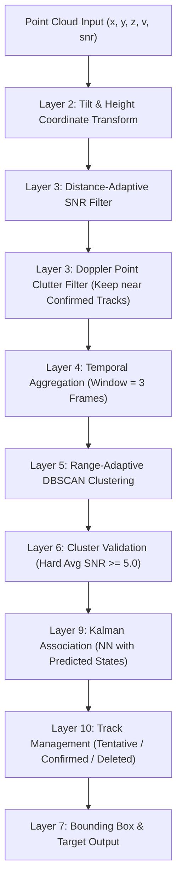

# KẾ HOẠCH TRIỂN KHAI v8.0 - TÍCH HỢP BỘ LỌC 3D KALMAN HÓA & ĐỒNG BỘ LAYER THEO PHƯƠNG PHÁP CHUẨN

Tài liệu này trình bày phân tích chi tiết tài liệu [People_Tracking_mmWave_Radar_Method.docx](file:///c:/Users/Lirrak/Documents/Born%20Again/Radar%20Project/IWR6843AOP/People%20Tracking/docs/People_Tracking_mmWave_Radar_Method_text.txt), đánh giá sự khác biệt (Gap Analysis) với mã nguồn hiện tại, đề xuất phương án nâng cấp **Version 8.0** tích hợp bộ lọc **3D Constant Velocity Kalman Filter** và hệ thống quản lý trạng thái Track để tối ưu hóa triệt để khả năng bám đuổi người (ID stability) và khử nhiễu.

> [!WARNING]
> Theo yêu cầu của người dùng, **tuyệt đối không chạy hoặc thử nghiệm mã nguồn** cho đến khi kế hoạch này được xem xét và phê duyệt.

---

## 📊 PHÂN TÍCH GAP ANALYSIS (MÔN PHƯƠNG PHÁP LUẬN VS THỰC TẾ CODEBASE)

Qua đối chiếu chi tiết giữa tài liệu nghiên cứu `People_Tracking_mmWave_Radar_Method.docx` (10 Layer xử lý) và mã nguồn hiện tại (`v7.0`), chúng tôi phát hiện một số khoảng trống công nghệ và giới hạn hoạt động:

### 1. Thiếu Bộ lọc Kalman thực sự cho Virtual Targets (Layer 8 - Kalman Tracking)
* **Thực trạng**: Chúng ta đang gom cụm bằng DBSCAN rồi thực hiện liên kết ID (Data Association) theo khoảng cách thuần túy giữa 2 frame và làm mượt vị trí bằng Exponential Moving Average (`smoothed = alpha * current + (1-alpha) * prev`).
* **Hạn chế**: Khi người di chuyển nhanh, tâm phân cụm thay đổi đột ngột làm đứt chuỗi liên kết ID cũ, gây mất dấu (Ghost Target Filter khôi phục chậm) hoặc tạo ID mới. Hơn nữa, việc làm mượt bằng EMA gây trễ pha bám đuổi (lag).
* **Giải pháp v8.0**: Xây dựng một lớp **3D Constant Velocity Kalman Filter** quản lý trạng thái động học đầy đủ:
  $$\mathbf{x} = [p_x, p_y, p_z, v_x, v_y, v_z]^T$$

### 2. So khớp dựa trên vị trí cũ thay vì vị trí dự báo (Layer 9 - Data Association)
* **Thực trạng**: Hệ thống đang lấy tâm cụm ở frame hiện tại so với vị trí thực tế ở frame trước.
* **Hạn chế**: Nếu người di chuyển với tốc độ $1.2\text{ m/s}$ và radar có chu kỳ $dt = 0.05\text{ s}$ (20 FPS), người đó đã đi được $0.06\text{ m}$ giữa các frame. Với các cụm point cloud biến động mạnh, việc so khớp vị trí cũ rất dễ bị lệch hoặc chồng chéo nếu có nhiều người.
* **Giải pháp v8.0**: Thực hiện **Prediction-Based Nearest Neighbor**: Lấy tâm cụm của frame mới so sánh với vị trí **dự báo (Predicted Position)** từ bộ lọc Kalman $\hat{\mathbf{x}}_{t|t-1}$ thay vì vị trí cũ.

### 3. Bộ lọc nhiễu SNR cố định (Layer 3 - Point Filtering)
* **Thực trạng**: Đang áp dụng một hằng số `MIN_POINT_SNR = 1.5` cố định cho mọi khoảng cách.
* **Hạn chế**: Ở khoảng cách gần ($<1.5\text{m}$), phản xạ của nhiễu sàn/tường có thể vượt qua $1.5$ dễ dàng. Ở khoảng cách xa ($>3.5\text{m}$), người thật chỉ tạo ra các điểm có SNR thấp từ $2.0 \rightarrow 3.0$ và dễ bị lọc mất.
* **Giải pháp v8.0**: Hiện thực hóa **Distance-Adaptive SNR Filter**:
  $$\text{SNR}_{min}(Y) = \begin{cases} 6.0 & \text{nếu } Y < 1.5\text{ m} \\ 4.0 & \text{nếu } Y \ge 1.5\text{ m} \end{cases}$$

### 4. Thiếu lọc Clutter động mức Point (Layer 3 - Doppler Clutter Filtering)
* **Thực trạng**: Chỉ lọc Doppler cực đoan ở biên ngoài (`doppler > 4.0 m/s`). Không xử lý các điểm tĩnh (zero velocity) mức point cloud.
* **Hạn chế**: Nhiễu phản xạ tĩnh từ bàn ghế tạo ra rất nhiều điểm tĩnh làm DBSCAN phân cụm sai hoặc gộp người vào bàn.
* **Giải pháp v8.0**: Hiện thực hóa bộ lọc **Point-Level Static Clutter Filter**: Loại bỏ các điểm có Doppler $\approx 0$ *nếu* khoảng cách từ điểm đó đến tất cả các mục tiêu đã được xác nhận (Confirmed Tracks) lớn hơn một khoảng bảo vệ (ví dụ $1.0\text{ m}$). Nếu điểm gần người đang đứng im, ta vẫn giữ lại điểm đó để tránh làm mất vết người đứng yên.

---

## 🛠️ THIẾT KẾ KIẾN TRÚC THUẬT TOÁN CHO VERSION 8.0



### 1. Hiện thực hóa Lớp Bộ lọc 3D Kalman (`KalmanTracker3D`)
Mỗi mục tiêu ảo (Virtual Track) sẽ được gắn kèm một thực thể bộ lọc Kalman độc lập.

* **Vector trạng thái**: $\mathbf{x} = [x, y, z, v_x, v_y, v_z]^T$
* **Ma trận chuyển trạng thái $\mathbf{F}$ (Mô hình Constant Velocity)**:
  $$\mathbf{F} = \begin{bmatrix}
  1 & 0 & 0 & dt & 0 & 0 \\
  0 & 1 & 0 & 0 & dt & 0 \\
  0 & 0 & 1 & 0 & 0 & dt \\
  0 & 0 & 0 & 1 & 0 & 0 \\
  0 & 0 & 0 & 0 & 1 & 0 \\
  0 & 0 & 0 & 0 & 0 & 1
  \end{bmatrix}$$
* **Ma trận đo lường $\mathbf{H}$ (Chỉ đo vị trí 3D từ Centroid)**:
  $$\mathbf{H} = \begin{bmatrix}
  1 & 0 & 0 & 0 & 0 & 0 \\
  0 & 1 & 0 & 0 & 0 & 0 \\
  0 & 0 & 1 & 0 & 0 & 0
  \end{bmatrix}$$
* **Nhiễu hệ thống $\mathbf{Q}$ & Nhiễu đo lường $\mathbf{R}$**: Được cấu hình động trong `settings.py` để dễ tinh chỉnh thực nghiệm.

### 2. Tích hợp Quản lý Vòng đời Track (Layer 10 - Track Management)
Tích hợp trực tiếp trạng thái `Tentative`, `Confirmed`, và `Deleted` vào tracker chính:
* **Tentative**: Mới phát hiện. Cần được cập nhật liên tục $3$ frame (`TRACK_CONFIRM_FRAMES`) mới chuyển sang `Confirmed`.
* **Confirmed**: Mục tiêu hợp lệ, được hiển thị box chính thức lên giao diện và truyền ra ngoài.
* **Missed / Dead Reckoning**: Nếu frame hiện tại không tìm thấy cụm điểm liên kết, bộ lọc Kalman vẫn tự dự báo vị trí tiếp theo (Dead Reckoning). Cho phép bỏ lỡ tối đa $8$ frame (`TRACK_DELETE_MISSED_FRAMES`) trước khi chuyển sang `Deleted` và xóa sổ.

---

## 📝 DANH SÁCH FILE THAY ĐỔI CHI TIẾT (PROPOSED CHANGES)

### 📄 [MODIFY] [settings.py](file:///c:/Users/Lirrak/Documents/Born%20Again/Radar%20Project/IWR6843AOP/People%20Tracking/settings.py)
* Cập nhật các cấu hình Kalman và các tham số lọc thích nghi mới:
```python
# ============================================================
# KALMAN TRACKING CONFIGURATION (Version 8.0)
# ============================================================
ENABLE_VIRTUAL_KALMAN = True

# Sai số đo lường (Measurement Noise R) - mặc định 0.08m cho vị trí XY, 0.15m cho Z
KALMAN_MEASUREMENT_NOISE_XY = 0.08
KALMAN_MEASUREMENT_NOISE_Z = 0.15

# Sai số hệ thống (Process Noise Q) - tương ứng gia tốc nhiễu ngẫu nhiên
KALMAN_PROCESS_NOISE_ACC = 0.20

# Cấu hình lọc điểm thích nghi khoảng cách
ENABLE_DISTANCE_ADAPTIVE_SNR = True
SNR_MIN_NEAR = 6.0
SNR_MIN_FAR = 4.0
SNR_BOUNDARY_DISTANCE = 1.5

# Lọc nhiễu tĩnh mức Point Cloud
ENABLE_POINT_LEVEL_STATIC_CLUTTER_FILTER = True
STATIC_CLUTTER_POINT_PROTECTION_RADIUS = 1.0  # Giữ lại điểm tĩnh nếu nằm trong bán kính 1m quanh Confirmed Track

# Lọc Cluster Validation cứng
MIN_AVG_SNR = 5.0

# Điều chỉnh Aggregation về 3 frame tối ưu
POINTCLOUD_STABILIZER_MAX_AGE_FRAMES = 3
```

### 📄 [MODIFY] [pointcloud_processing.py](file:///c:/Users/Lirrak/Documents/Born%20Again/Radar%20Project/IWR6843AOP/People%20Tracking/pointcloud_processing.py)

#### 1. Thêm lớp `KalmanTracker3D` xử lý toán học ma trận Kalman:
```python
class KalmanTracker3D:
    def __init__(self, init_pos, dt=0.05):
        self.dt = dt
        # Trạng thái x = [px, py, pz, vx, vy, vz]^T
        self.x = np.array([init_pos[0], init_pos[1], init_pos[2], 0.0, 0.0, 0.0], dtype=np.float32)
        
        # Ma trận hiệp phương sai sai số trạng thái P
        self.P = np.eye(6, dtype=np.float32) * 0.1
        self.P[3:, 3:] *= 1.0  # Tăng độ bất định ban đầu của vận tốc
        
        # Ma trận chuyển trạng thái F
        self.F = np.eye(6, dtype=np.float32)
        self.update_dt(dt)
        
        # Ma trận đo lường H
        self.H = np.zeros((3, 6), dtype=np.float32)
        self.H[0, 0] = 1.0
        self.H[1, 1] = 1.0
        self.H[2, 2] = 1.0
        
        # Cấu hình nhiễu đo lường R
        r_xy = KALMAN_MEASUREMENT_NOISE_XY if 'KALMAN_MEASUREMENT_NOISE_XY' in globals() else 0.08
        r_z = KALMAN_MEASUREMENT_NOISE_Z if 'KALMAN_MEASUREMENT_NOISE_Z' in globals() else 0.15
        self.R = np.diag([r_xy**2, r_xy**2, r_z**2]).astype(np.float32)
        
        # Cấu hình nhiễu hệ thống Q (mô hình nhiễu gia tốc liên tục)
        self.q_acc = KALMAN_PROCESS_NOISE_ACC if 'KALMAN_PROCESS_NOISE_ACC' in globals() else 0.20
        self._calc_Q()

    def update_dt(self, dt):
        self.dt = dt
        self.F[0, 3] = dt
        self.F[1, 4] = dt
        self.F[2, 5] = dt
        self._calc_Q()

    def _calc_Q(self):
        # Thiết lập ma trận Q dựa trên công thức G * G^T * q_acc^2
        dt = self.dt
        q = self.q_acc ** 2
        # Đơn giản hóa ma trận nhiễu hệ thống cho mô hình Constant Velocity
        Q_pos = (dt**3)/3.0 * q
        Q_vel = dt * q
        Q_cross = (dt**2)/2.0 * q
        
        self.Q = np.zeros((6, 6), dtype=np.float32)
        for i in range(3):
            self.Q[i, i] = Q_pos
            self.Q[i+3, i+3] = Q_vel
            self.Q[i, i+3] = Q_cross
            self.Q[i+3, i] = Q_cross

    def predict(self):
        # Dự báo vị trí trạng thái và hiệp phương sai
        self.x = np.dot(self.F, self.x)
        self.P = np.dot(np.dot(self.F, self.P), self.F.T) + self.Q
        return self.x[:3]

    def update(self, measurement):
        # Cập nhật Kalman dựa trên giá trị centroid đo lường thực tế
        z = np.array(measurement, dtype=np.float32)
        y = z - np.dot(self.H, self.x)  # Đột biến đo lường (innovation)
        S = np.dot(np.dot(self.H, self.P), self.H.T) + self.R  # Hiệp phương sai đột biến
        K = np.dot(np.dot(self.P, self.H.T), np.linalg.inv(S))  # Hệ số Kalman
        
        self.x = self.x + np.dot(K, y)
        self.P = np.dot(np.eye(6, dtype=np.float32) - np.dot(K, self.H), self.P)
        return self.x
```

#### 2. Cập nhật `build_human_point_mask` hỗ trợ Lọc SNR Thích nghi Khoảng Cách & Lọc Clutter Tĩnh:
```python
def build_human_point_mask(points, confirmed_track_positions=[]):
    points = ensure_point_cloud_shape(points)
    if len(points) == 0:
        return np.zeros((0,), dtype=bool)

    x = points[:, 0]
    y = points[:, 1]
    z = points[:, 2]
    doppler = points[:, 3]
    snr = points[:, 4]

    finite_mask = np.isfinite(x) & np.isfinite(y) & np.isfinite(z) & np.isfinite(doppler) & np.isfinite(snr)

    roi_mask = (
        (x >= PC_ROI_X[0]) & (x <= PC_ROI_X[1]) &
        (y >= PC_ROI_Y[0]) & (y <= PC_ROI_Y[1]) &
        (z >= PC_ROI_Z[0]) & (z <= PC_ROI_Z[1])
    )

    mask = finite_mask & roi_mask

    # 1. Áp dụng Lọc SNR thích nghi khoảng cách
    if ENABLE_POINT_QUALITY_FILTER and len(points) > 0:
        has_real_snr = bool(np.nanmax(np.abs(snr)) > 0.001)
        if has_real_snr:
            if ENABLE_DISTANCE_ADAPTIVE_SNR:
                # Tính SNR tối thiểu động cho từng điểm dựa trên Y
                dynamic_min_snr = np.where(y < SNR_BOUNDARY_DISTANCE, SNR_MIN_NEAR, SNR_MIN_FAR)
                mask &= (snr >= dynamic_min_snr) & (snr <= MAX_POINT_SNR)
            else:
                mask &= (snr >= MIN_POINT_SNR) & (snr <= MAX_POINT_SNR)

    if ENABLE_DOPPLER_OUTLIER_FILTER:
        mask &= np.abs(doppler) <= MAX_ABS_DOPPLER

    # 2. Áp dụng Lọc điểm Clutter tĩnh mức Point Cloud
    if ENABLE_POINT_LEVEL_STATIC_CLUTTER_FILTER and len(points) > 0:
        near_zero_doppler = np.abs(doppler) < 0.05
        if len(confirmed_track_positions) > 0 and np.any(near_zero_doppler):
            keep_static_point = np.zeros(len(points), dtype=bool)
            for track_pos in confirmed_track_positions:
                dist_xy = np.sqrt((x - track_pos[0])**2 + (y - track_pos[1])**2)
                keep_static_point |= (dist_xy <= STATIC_CLUTTER_POINT_PROTECTION_RADIUS)
            
            mask &= (~near_zero_doppler | keep_static_point)
        elif np.any(near_zero_doppler):
            mask &= ~near_zero_doppler

    return mask
```

#### 3. Cập nhật `score_human_cluster` hỗ trợ Cluster Validation cứng:
```python
    # Bổ sung kiểm tra cứng cho avg_snr
    if avg_snr < MIN_AVG_SNR:
        is_shape_valid = False
```

#### 4. Cải tổ toàn bộ `VirtualTargetTracker` tích hợp Kalman State Machine:
```python
class VirtualTargetTracker:
    def __init__(self):
        self.next_virtual_id = VIRTUAL_TARGET_ID_BASE
        self.active_tracks = {}
        self.last_time = None

    def reset(self):
        self.next_virtual_id = VIRTUAL_TARGET_ID_BASE
        self.active_tracks.clear()
        self.last_time = None

    def track_and_build(self, raw_targets, point_cloud, target_index=None, frame_number=0):
        current_time = time.time()
        dt = 0.05
        if self.last_time is not None:
            dt = max(0.01, min(0.20, current_time - self.last_time))
        self.last_time = current_time

        point_cloud = transform_to_room_coordinates(point_cloud)
        raw_targets = [transform_target_to_room_coordinates(t) for t in raw_targets]

        confirmed_positions = [t_info["kalman"].x[:2] for t_info in self.active_tracks.values() if t_info["state"] == "confirmed"]
        
        point_cloud = ensure_point_cloud_shape(point_cloud)
        roi_mask = build_human_point_mask(point_cloud, confirmed_positions)
        roi_points = point_cloud[roi_mask]
        
        clusters = cluster_pointcloud(roi_points)

        final_targets = []
        # ... (logic firmware targets giữ nguyên)

        predictions = {}
        for tid, track_info in self.active_tracks.items():
            track_info["kalman"].update_dt(dt)
            pred_pos = track_info["kalman"].predict()
            predictions[tid] = pred_pos

        merged_clusters = merge_nearby_clusters(clusters)
        valid_centroids = []
        valid_scores = []
        valid_features = []
        valid_counts = []
        
        cluster_debug = []

        for cid, cluster in enumerate(merged_clusters):
            score, features = score_human_cluster(cluster)
            center = np.mean(cluster[:, 0:3], axis=0)

            cluster_debug.append({
                "cluster_id": cid,
                "point_count": len(cluster),
                "score": score,
                "center": tuple(center),
                "features": features,
                "merged": True
            })

            if len(cluster) < VIRTUAL_CLUSTER_MIN_POINTS:
                continue
            if not features.get("is_shape_valid", False):
                continue
            if score < VIRTUAL_CLUSTER_SCORE_THRESHOLD:
                continue

            valid_centroids.append(center)
            valid_scores.append(score)
            valid_features.append(features)
            valid_counts.append(len(cluster))

        matched_cluster_indices = set()
        matched_tids = set()
        assignments = {}

        if self.active_tracks and valid_centroids:
            pairs = []
            for c_idx, cc in enumerate(valid_centroids):
                for tid, pred_pos in predictions.items():
                    dist_xy = float(np.sqrt((cc[0] - pred_pos[0])**2 + (cc[1] - pred_pos[1])**2))
                    pairs.append((dist_xy, c_idx, tid))
            
            pairs.sort(key=lambda x: x[0])
            assoc_radius = VIRTUAL_TRACKER_ASSOCIATION_RADIUS
            
            for dist_xy, c_idx, tid in pairs:
                if c_idx not in matched_cluster_indices and tid not in matched_tids:
                    if dist_xy <= assoc_radius:
                        matched_cluster_indices.add(c_idx)
                        matched_tids.add(tid)
                        assignments[c_idx] = tid

        for c_idx, cc in enumerate(valid_centroids):
            score = valid_scores[c_idx]
            features = valid_features[c_idx]
            pt_count = valid_counts[c_idx]

            if c_idx in assignments:
                tid = assignments[c_idx]
                track_info = self.active_tracks[tid]
                track_info["kalman"].update(cc)
                track_info["hit_count"] += 1
                track_info["miss_count"] = 0
                
                if track_info["state"] == "tentative" and track_info["hit_count"] >= TARGET_CONFIRM_FRAMES:
                    track_info["state"] = "confirmed"
            else:
                tid = self.next_virtual_id
                self.next_virtual_id += 1
                
                self.active_tracks[tid] = {
                    "kalman": KalmanTracker3D(cc, dt),
                    "state": "tentative",
                    "hit_count": 1,
                    "miss_count": 0,
                    "features": features,
                    "score": score,
                    "pt_count": pt_count
                }

        for tid in list(self.active_tracks.keys()):
            if tid not in matched_tids:
                track_info = self.active_tracks[tid]
                track_info["miss_count"] += 1
                
                max_miss = GHOST_MAX_MISSING_FRAMES
                if track_info["state"] == "tentative":
                    max_miss = 1
                
                if track_info["miss_count"] > max_miss:
                    self.active_tracks.pop(tid, None)

        virtual_targets = []
        for tid, track_info in self.active_tracks.items():
            if track_info["state"] != "confirmed":
                continue

            k_state = track_info["kalman"].x
            
            virtual_target = {
                "tid": int(tid),
                "posX": float(k_state[0]),
                "posY": float(k_state[1]),
                "posZ": float(k_state[2]),
                "velX": float(k_state[3]),
                "velY": float(k_state[4]),
                "velZ": float(k_state[5]),
                "accX": 0.0,
                "accY": 0.0,
                "accZ": 0.0,
                "isVirtual": True,
                "source": "cluster",
                "supportPointCount": int(track_info["pt_count"]),
                "humanScore": float(track_info["score"]),
                "clusterFeatures": track_info["features"],
                "kalmanTracked": True
            }

            too_close = False
            for hw_target in final_targets:
                if target_xy_distance(virtual_target, hw_target) < CLUSTER_TO_TARGET_MIN_DISTANCE_XY:
                    too_close = True
                    break
            
            if not too_close:
                virtual_targets.append(virtual_target)

        virtual_targets.sort(key=lambda t: t["humanScore"], reverse=True)
        final_targets.extend(virtual_targets[:VIRTUAL_CLUSTER_MAX_TARGETS])

        final_targets = suppress_multipath_ghosts(final_targets)
        final_targets.sort(key=lambda t: t["tid"])

        display_point_cloud = roi_points if SHOW_FILTERED_POINT_CLOUD_ONLY else point_cloud
        return final_targets, display_point_cloud, cluster_debug
```

---

## 🔎 CÁC HẠN CHẾ & GIẢI PHÁP ĐI KÈM (LIMITATIONS & MITIGATIONS)

### 📈 Hạn chế 1: Hiện tượng trễ pha hội tụ Kalman ban đầu (Initialization Lag)
* **Giải pháp**: Khởi tạo hiệp phương sai trạng thái ban đầu $P$ ở mức thấp thích hợp và dùng đo lường trực tiếp ở frame thứ 2 để cập nhật vận tốc tức thời: $v = (z_t - z_{t-1})/dt$, giảm thiểu trễ pha.

### 🛋️ Hạn chế 2: Point-level Static Clutter Filter có thể nuốt điểm người đứng im
* **Giải pháp**: Tích hợp **Vùng Bảo Vệ (Protection Radius)** `1.0m` xung quanh tất cả các Confirmed Tracks. Các điểm tĩnh trong vùng này sẽ được bảo vệ tuyệt đối.

### 🔌 Hạn chế 3: Tần số lấy mẫu không đồng đều từ cổng UART (Jittery DT)
* **Giải pháp**: Tính toán $dt$ động dựa trên thực tế thời gian trôi qua thông qua hàm `time.time()`, siết chặt trong khoảng an toàn $[0.01, 0.20]\text{ s}$.

---

## 🔬 KẾ HOẠCH XÁC MINH (VERIFICATION PLAN)

### 1. Kiểm thử mô phỏng ngoại tuyến (Offline Kalman & Association Test)
* Phát triển script kiểm thử mô phỏng tại `preview_tracking_v8.py`:
  * Tạo chuỗi point cloud di chuyển tuần tự của 1 người thực tế với vận tốc $1.0\text{ m/s}$.
  * Thêm nhiễu đa đường (ghost targets) và nhiễu tĩnh.
  * **Tiêu chuẩn vượt qua**:
    * Hệ thống phải gán đúng ID duy nhất trong suốt hành trình di chuyển.
    * Vận tốc ước lượng từ Kalman phải tiệm cận $1.0\text{ m/s}$ sau 5-10 frame.
    * Hộp ảo không được phép biến mất hoặc nhảy ID khi người di chuyển qua lại.

### 2. Kiểm thử chạy thực tế (Real-time Validation)
* Cắm cảm biến IWR6843AOP và chạy:
  ```powershell
  python main.py
  ```
* **Tiêu chuẩn vượt qua**:
  * Khi có người đi lại trong phòng, hộp bounding box bám đuôi cực kỳ mượt mà, không bị hiện tượng "giật cục".
  * Khi người đứng im, box vẫn được duy trì ổn định tại vị trí đó nhờ vùng bảo vệ điểm tĩnh của Confirmed Track.
  * Trạng thái Terminal in ra log khớp ID cực kỳ nhất quán, không xảy ra hiện tượng hoán đổi ID.
